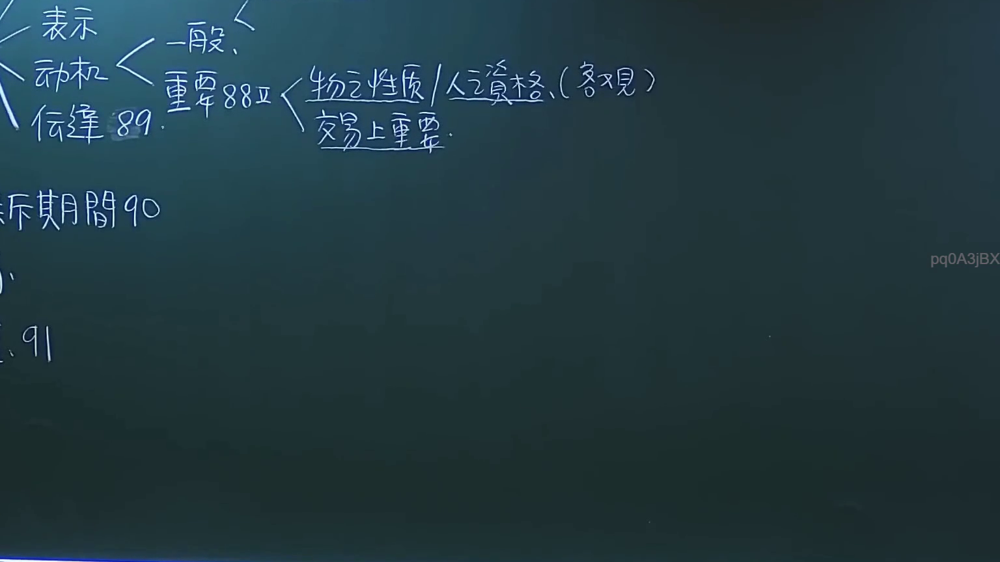

# 🎥 影音教材板書校對筆記
- **來源影片**: [預約 6 2024-10-18 14-16-59-231](file:///J://民法/ch6/預約 6 2024-10-18 14-16-59-231.mp4)
- **課程分類**: `[民法`
- **課堂章節**: `ch6]`
- **影片時間戳記**: `00:13:00` (780 秒)
- **板書類型**: `關係圖/邏輯圖板書`
- **偵測時間**: 2026-07-12 19:44:41

## 🔍 擷取黑板板書對照圖


## 🧠 AI 智慧理解與知識庫演化註記
目前提供的 OCR辨识文字為「pq0A3jBx」，這是一種非可见字符的组合，无法直接转换为有意义的文字。因此，無法進行語意整理或與臺灣現行法律條文（如民法第184條、侵權行為、消滅時效等）進行比對。

建議您能提供更清晰或完整的板書內容，以便進一步分析和處理。

## 📊 可編輯之 Mermaid 關係流程圖
```mermaid
因缺乏 board content，無法生成 Mermaid.js 流程圖代碼。
```

## ✍️ 操作者手動校對修改區
<!-- 您可以直接修改上方的文字或調整 Mermaid 區塊中的節點，Obsidian 會即時重新渲染 -->
- [ ] 欄位結構與法律邏輯已校對無誤。
- **校對筆記**: 
