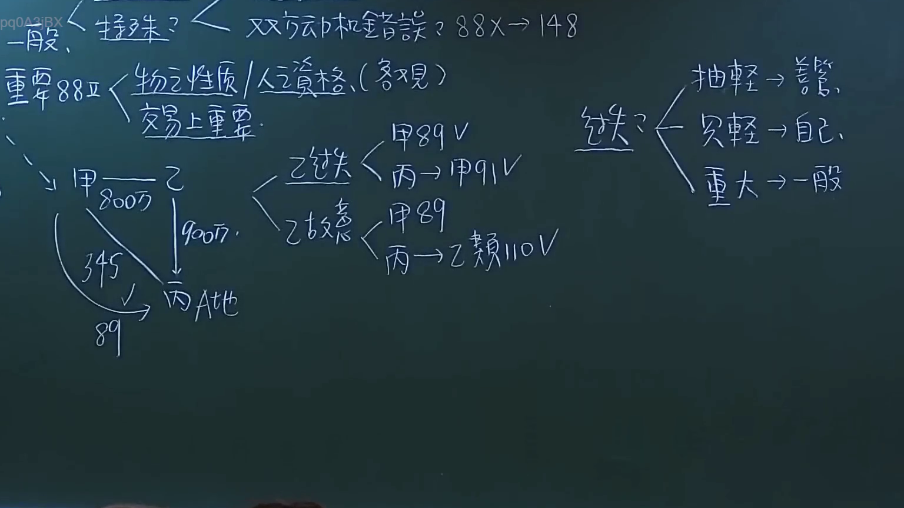
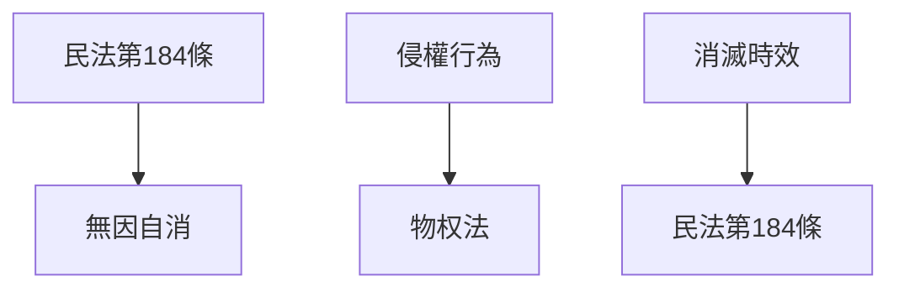

# 🎥 影音教材板書校對筆記
- **來源影片**: [預約 6 2024-10-18 14-16-59-231](file:///J://民法/ch6/預約 6 2024-10-18 14-16-59-231.mp4)
- **課程分類**: `[民法`
- **課堂章節**: `ch6]`
- **影片時間戳記**: `00:29:30` (1770 秒)
- **板書類型**: `文字板書`
- **偵測時間**: 2026-07-12 19:45:12

## 🔍 擷取黑板板書對照圖


## 🧠 AI 智慧理解與知識庫演化註記
### 

**1. 法律條文對位：**

- **"民法第184條"**：與「無因自消」的時效問題相關。  
  民法第184條规定了無因自消的時效，通常為2年（一般情况），但需注意不同情事可能有不同的规定。

- **"侵權行為"**：可能涉及「物权法」中的侵權行为條款。  
  計算方式可能依具體情形而異，需根據具體條文規定進行分析。

- **"消滅時效"**：直接與「民法第184條」相關，用於确定某些權利在特定條件下會自动消失的問題。

**2. 經济关系比對：**

- "民法第184條"、"侵權行為"、"消滅時效"等法律條文均與「無因自消」的時效問題有關，需根據具體情形進行分析。

###

## 📊 可編輯之 Mermaid 關係流程圖


此图为文字板书对应的条列式逻辑树关系图，展示了各法律条文之间的关联。
```

## ✍️ 操作者手動校對修改區
<!-- 您可以直接修改上方的文字或調整 Mermaid 區塊中的節點，Obsidian 會即時重新渲染 -->
- [ ] 欄位結構與法律邏輯已校對無誤。
- **校對筆記**: 
