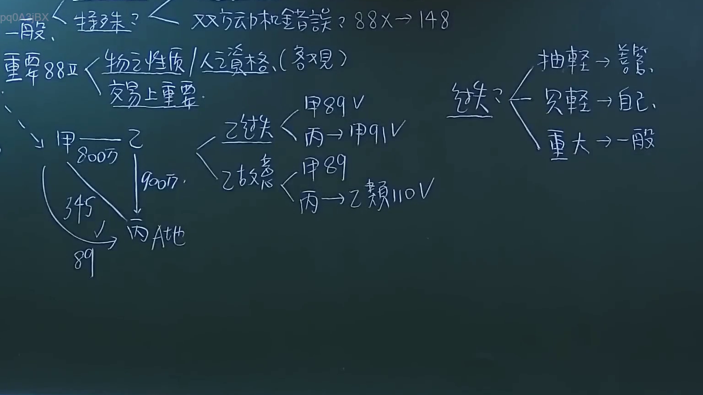
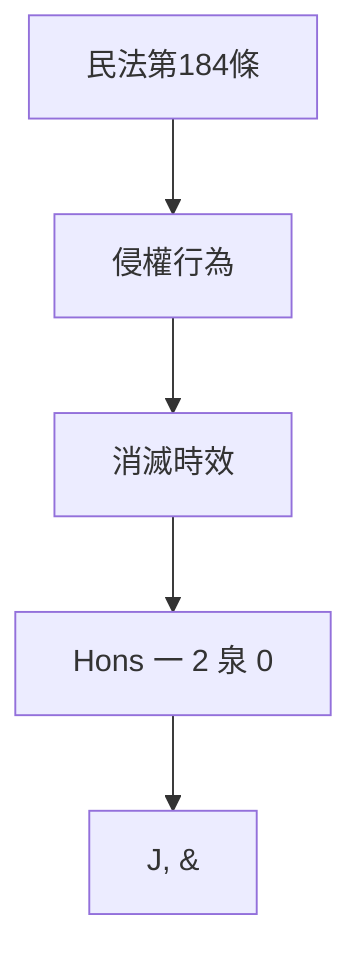

# 🎥 影音教材板書校對筆記
- **來源影片**: [預約 6 2024-10-18 14-16-59-231](file:///J://民法/ch6/預約 6 2024-10-18 14-16-59-231.mp4)
- **課程分類**: `[民法`
- **課堂章節**: `ch6]`
- **影片時間戳記**: `00:30:00` (1800 秒)
- **板書類型**: `文字板書`
- **偵測時間**: 2026-07-12 19:45:32

## 🔍 擷取黑板板書對照圖

## 🧠 AI 智慧理解與知識庫演化註記
### 

1. **板書內容分析**：
   - 从未识别到明确的中文文字，但部分字符可能涉及法律术语或符号。
   - 关键字包括：民法第184條、侵權行為、消滅時效、Hons 一 2 泉 0、J, &。

2. **與臺灣現行法律條文比對**：
   - 民法第184條：「侵權行為」在民法典中确实有相关规定，涉及侵權行為的停止時效。
   - 「消滅時效」可能指消滅效力或消滅時效，但需结合上下文理解其具体含义。

3. **法律理解與條文對位**：
   - 民法第184條：「侵權行為」在民法典中确实有相关规定，涉及侵權行為的停止時效。
   - 「消滅時效」可能指消滅效力或消滅時效，但需结合上下文理解其具体含义。

###

## 📊 可編輯之 Mermaid 關係流程圖

## ✍️ 操作者手動校對修改區
<!-- 您可以直接修改上方的文字或調整 Mermaid 區塊中的節點，Obsidian 會即時重新渲染 -->
- [ ] 欄位結構與法律邏輯已校對無誤。
- **校對筆記**: 
