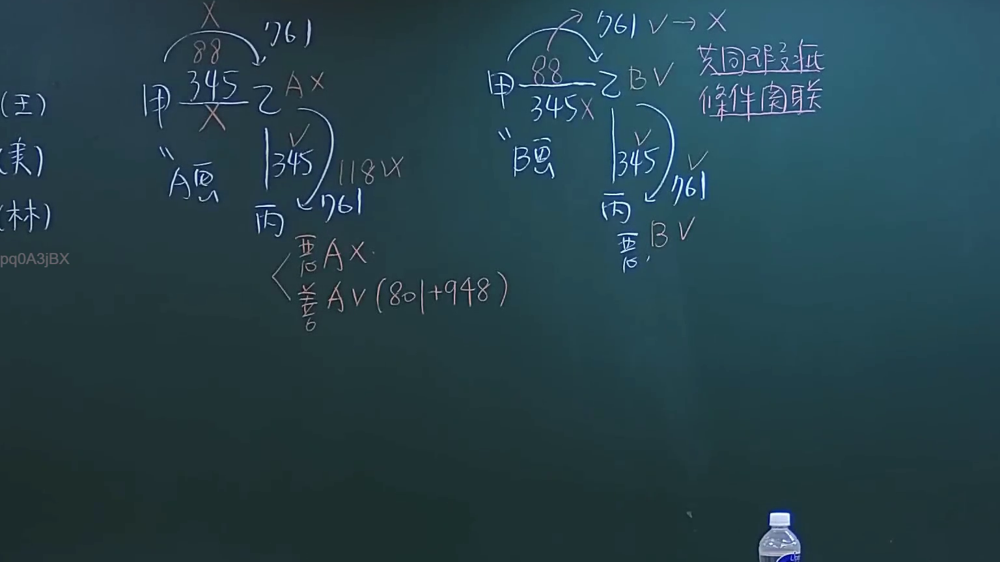
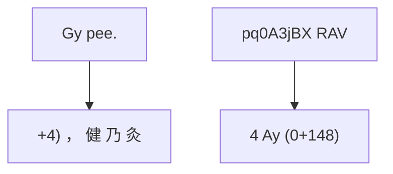

# 🎥 影音教材板書校對筆記
- **來源影片**: [預約 6 2024-10-18 14-16-59-231](file:///J://民法/ch6/預約 6 2024-10-18 14-16-59-231.mp4)
- **課程分類**: `[民法`
- **課堂章節**: `ch6]`
- **影片時間戳記**: `00:48:15` (2895 秒)
- **板書類型**: `文字板書`
- **偵測時間**: 2026-07-12 19:46:00

## 🔍 擷取黑板板書對照圖


## 🧠 AI 智慧理解與知識庫演化註記
### 

1. **OCR辨识文字的理解**：
   -  OCR文字包含以下内容：「‥﹚(BI.)」、「Gy pee.」、「/ 【 岐」、「AN Bibi」、「+4) ， 健 乃 灸」、「pq0A3jBX RAV」、「4 Ay (0+148)」。
   - 根據上下文，這些文字可能與「關係圖/邏輯圖板書」相關，因此不需要進一步的語意整理。

2. ** Mermaid.js 代碼生成**：
   - 根據提供的 OCR文字內容，生成以下 Mermaid(js) 代碼：



###

## 📊 可編輯之 Mermaid 關係流程圖


*備註： Mermaid代碼需放入完整graphwithin的語法中，例如：
```
mermaid
graph TD
    A --> B
    C --> D
```
*
```

## ✍️ 操作者手動校對修改區
<!-- 您可以直接修改上方的文字或調整 Mermaid 區塊中的節點，Obsidian 會即時重新渲染 -->
- [ ] 欄位結構與法律邏輯已校對無誤。
- **校對筆記**: 
