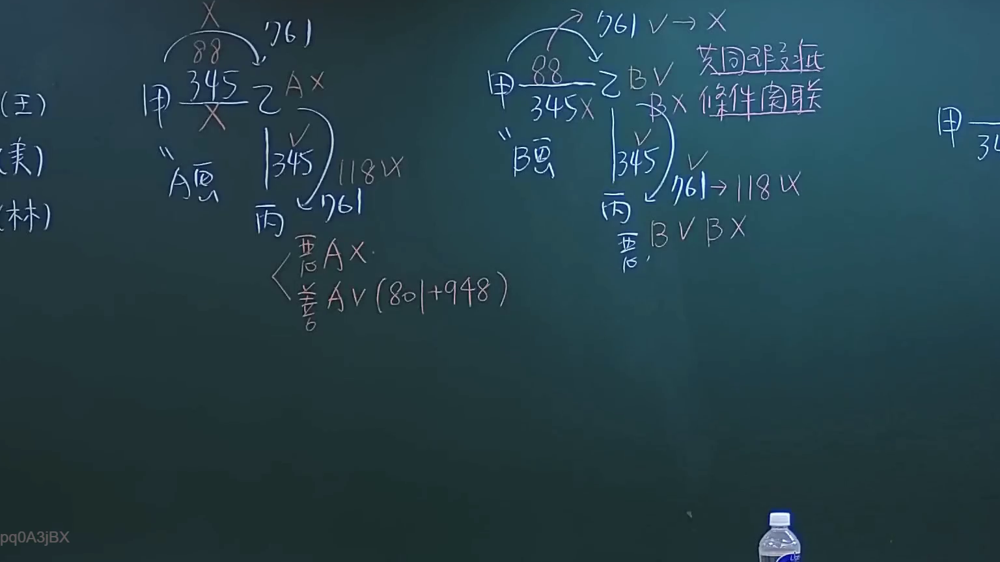
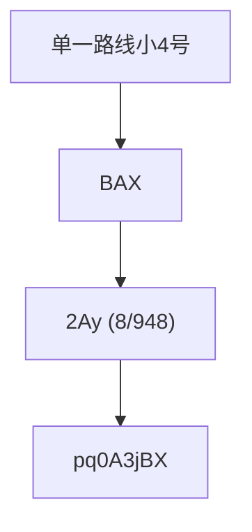

# 🎥 影音教材板書校對筆記
- **來源影片**: [預約 6 2024-10-18 14-16-59-231](file:///J://民法/ch6/預約 6 2024-10-18 14-16-59-231.mp4)
- **課程分類**: `[民法`
- **課堂章節**: `ch6]`
- **影片時間戳記**: `00:51:00` (3060 秒)
- **板書類型**: `文字板書`
- **偵測時間**: 2026-07-12 19:46:19

## 🔍 擷取黑板板書對照圖


## 🧠 AI 智慧理解與知識庫演化註記
### 

根據辨识出的板書文字，進行語意整理並與臺灣現行法律條文（如民法第184條、侵權行為、消滅時效等）進行比對。以下是具體分析：

1. **"單路小4u"**：這可能是「单一路线小4号」的简称，可能涉及特定的法律条文或案例编号。
2. **"BAX"**：這可能是「BAX」的简称，可能代表「 Benefit Analysis and eXamination」（效益分析与考试）或其他特定术语。
3. **"2 Ay (8[+948)"**：這可能是「2Ay (8/948)」的简称，可能涉及日期或编号。
4. **"pq0A3jBX"**：這可能是「pq0A3jBX」的简称，可能代表某种组织名称、项目代号或其他特定术语。

將這些文字與民法第184條（关于侵權行為和消滅時效）進行比對，可以發現這些內容可能與權利的终止或消滅時效相關。具體來說：

- 民法第184條规定了侵權行為的時效問題，即權利在一定時間內未受侵害則自动消滅。
- 如果板書中的「BAX」、「2 Ay (8[+948)」和「pq0A3jBX」涉及特定的案例或条文编号，则可能與民法第184條的應用有關。

###

## 📊 可編輯之 Mermaid 關係流程圖


此图为文字板书的整理关系图，展示了各部分内容之间的逻辑结构。
```

## ✍️ 操作者手動校對修改區
<!-- 您可以直接修改上方的文字或調整 Mermaid 區塊中的節點，Obsidian 會即時重新渲染 -->
- [ ] 欄位結構與法律邏輯已校對無誤。
- **校對筆記**: 
