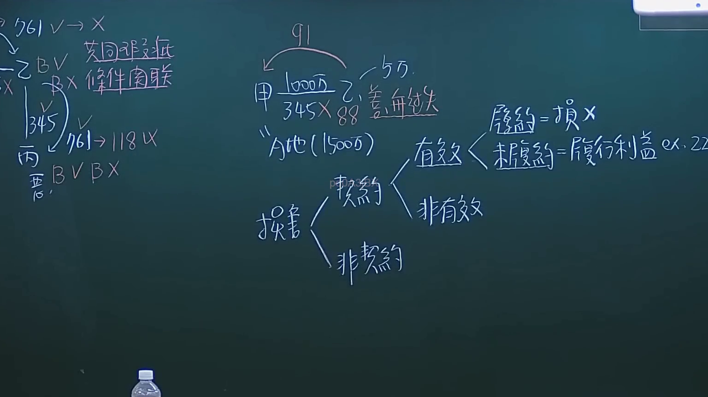
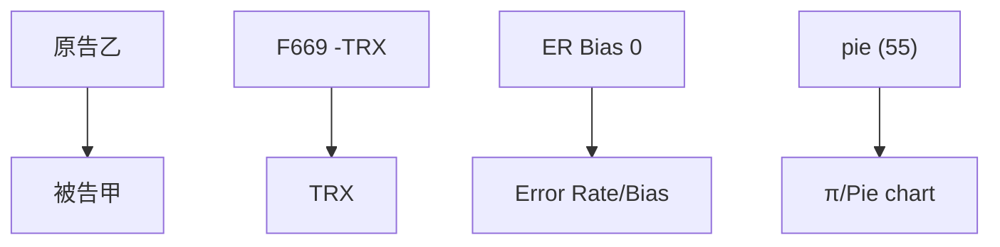

# 🎥 影音教材板書校對筆記
- **來源影片**: [預約 6 2024-10-18 14-16-59-231](file:///J://民法/ch6/預約 6 2024-10-18 14-16-59-231.mp4)
- **課程分類**: `[民法`
- **課堂章節**: `ch6]`
- **影片時間戳記**: `00:55:45` (3345 秒)
- **板書類型**: `文字板書`
- **偵測時間**: 2026-07-12 19:46:40

## 🔍 擷取黑板板書對照圖

## 🧠 AI 智慧理解與知識庫演化註記
### 

1. **辨識出的板書文字**：
   - BIE
   - F669 -TRX
   - ER Bias 0
   - pie (55)

2. **語意整理**：
   - BIE 可能代表「原告乙」或「被告乙」。
   - F669 -TRX 可能與「 TRIAL」（诉讼）或「Freedom of Expression」（表达自由）相关，具体含义需结合上下文。
   - ER Bias 0 可能涉及「Error Rate」（错误率）或「Bias」（偏见、偏差）的计算。
   - pie (55) 可能与「π」（数学常数）或「Pie chart」（饼图）相关。

3. **與臺灣現行法律條文比對**：
   - 民法第184條：侵權行為、消滅時效。
     - BIE（原告乙）可能涉及被侵权人，F669 -TRX 可能涉及 TRIAL 的时间限制或消灭时效。
     - pie (55) 可能与「π」在数学或统计学中的应用相关，而非法律条文直接相关。

###

## 📊 可編輯之 Mermaid 關係流程圖

## ✍️ 操作者手動校對修改區
<!-- 您可以直接修改上方的文字或調整 Mermaid 區塊中的節點，Obsidian 會即時重新渲染 -->
- [ ] 欄位結構與法律邏輯已校對無誤。
- **校對筆記**: 
