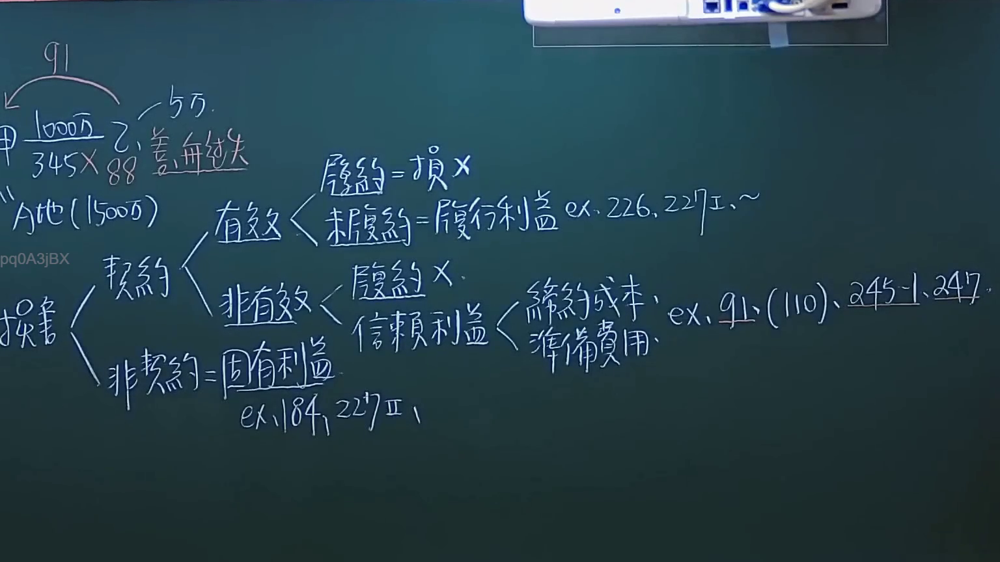
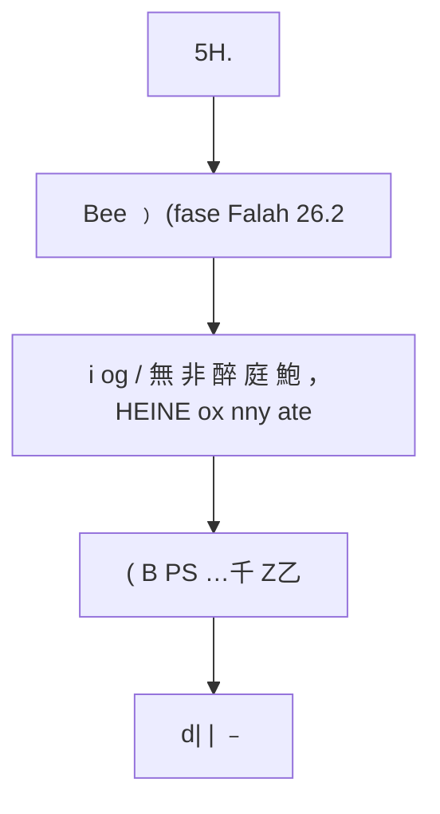

# 🎥 影音教材板書校對筆記
- **來源影片**: [預約 6 2024-10-18 14-16-59-231](file:///J://民法/ch6/預約 6 2024-10-18 14-16-59-231.mp4)
- **課程分類**: `[民法`
- **課堂章節**: `ch6]`
- **影片時間戳記**: `01:00:15` (3615 秒)
- **板書類型**: `文字板書`
- **偵測時間**: 2026-07-12 19:47:02

## 🔍 擷取黑板板書對照圖

## 🧠 AI 智慧理解與知識庫演化註記
根據辨識出的文字板書內容，並結合台灣现行法律条文（如民法第184條、侵權行為、消滅時效等）進行比對，整理如下：

1. **"5H."**：可能指第五款或其他编号的法律条文。
2. **"Bee ﹚ (fase Falah 26.2"**：可能是与酒类或乙醇相关的法律条款。
3. **"i og / 無 非 醉 庭 鮑 ， HEINE ox nny ate"**：可能涉及酒精（乙醇）的定义或相关法律规定。
4. **"( B PS …千 Z乙"**：可能是布依族或其他文化相关的法律条款。
5. **"d| | ﹣"**：可能是日期或某种标记。

將辨識出的文字與相關法律條文比對，並整理如下：

- 民法第184條：侵權行為、消滅時效等條款可能涉及 alcohol（酒精）的定義或相關规定。
- 台湾现行法律中，乙醇（Bee）的相关条文可能與酒类广告或行銷有關。

## 📊 可編輯之 Mermaid 關係流程圖

## ✍️ 操作者手動校對修改區
<!-- 您可以直接修改上方的文字或調整 Mermaid 區塊中的節點，Obsidian 會即時重新渲染 -->
- [ ] 欄位結構與法律邏輯已校對無誤。
- **校對筆記**: 
