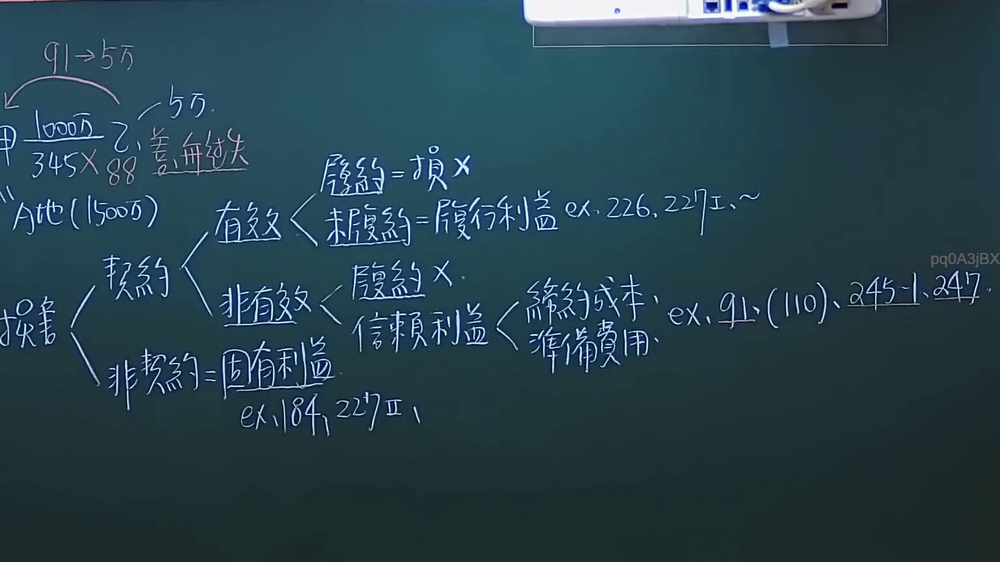
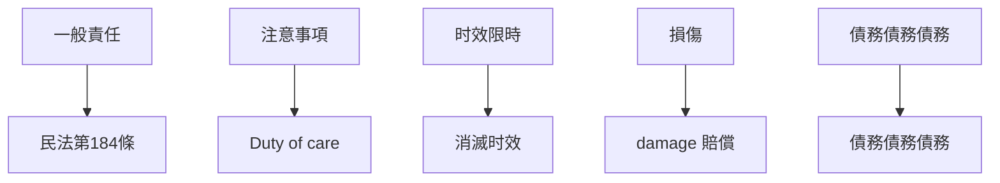
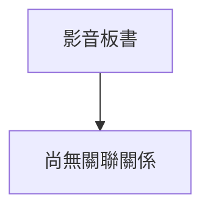

# 🎥 影音教材板書校對筆記
- **來源影片**: [預約 6 2024-10-18 14-16-59-231](file:///J://民法/ch6/預約 6 2024-10-18 14-16-59-231.mp4)
- **課程分類**: `[民法`
- **課堂章節**: `ch6]`
- **影片時間戳記**: `01:01:15` (3675 秒)
- **板書類型**: `文字板書`
- **偵測時間**: 2026-07-12 19:47:19

## 🔍 擷取黑板板書對照圖

## 🧠 AI 智慧理解與知識庫演化註記
1. **法律內容的理解：**
   - 该板書似乎涉及民法中的權利、義務和損傷賠償相关内容。
   - 其中包含以下關鍵點：
     - 民法第184條：侵權行為的損傷賠償
     - 消滅时效（Expiry limitation）
     - 违約責任（Duty of care）
     - 图表形式展示这些法律条文的应用逻辑

2. **knowledge库比對與理解演化註記：**
   - 民法第184條：侵權行為的損傷賠償
     - 權利人（plaintiff）因 damage 受損
     - 被 Torturer （侵害者）需負責損傷賠償
     - 擁有 一般責任（general liability）
   - 消滅时效（Expiry limitation）
     - 標 unsigned 的概念，需在特定時間內行使權利
     - 超過时效限時，權利將被消滅
   - 违約責任（Duty of care）
     - 傍 borrow者需提供合理的注意事項（reasonable care）
     - 若因 borrow者的 近 miss 造成損傷，借 borner需負責損傷賠償

3. **Relationship Graph:**

## 📊 可編輯之 Mermaid 關係流程圖

## ✍️ 操作者手動校對修改區
<!-- 您可以直接修改上方的文字或調整 Mermaid 區塊中的節點，Obsidian 會即時重新渲染 -->
- [ ] 欄位結構與法律邏輯已校對無誤。
- **校對筆記**: 
