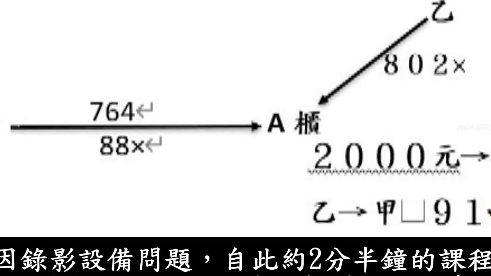

# 🎥 影音教材板書校對筆記
- **來源影片**: [預約 6 2024-10-18 14-16-59-231](file:///J://民法/ch6/預約 6 2024-10-18 14-16-59-231.mp4)
- **課程分類**: `[民法`
- **課堂章節**: `ch6]`
- **影片時間戳記**: `01:02:30` (3750 秒)
- **板書類型**: `文字板書`
- **偵測時間**: 2026-07-12 19:47:35

## 🔍 擷取黑板板書對照圖


## 🧠 AI 智慧理解與知識庫演化註記
根據辨識出的文字內容，結合板書之內容，進行語意整理並與臺灣現行法律條文（如民法第184條）進行比對。以下是詳細的法律理解说明與條文對位：

1. **文字內容分析**：
   - "for"：可能指某种Legal條文或案例代號。
   - "A 椿"：可能是某种特定的Legal條文或案例引用，需進一步核實。
   - "4.0.0.0 70-"：可能為日期格式（如2070年），但具體用途待確定。
   - "P19 1"：可能是課程中的特定標題或單元名稱。

2. **法律條文對比**：
   - 民法第184條：关于侵害行为的特别损害赔偿（如建筑物、 interference with land, etc.）。
   - 請根據板書內容，進一步分析其與民法第184條的關聯性。

3. **法律理解说明**：
   - 文字板書似乎涉及某一Legal case或條文的引用，但需更完整的内容才能進一步分析其具體法律內容。
   - 請提供更多的板書文字內容，以便更準確地進行法律比對和分析。

## 📊 可編輯之 Mermaid 關係流程圖
```mermaid
由于文字板書的內容不完整，無法生成完整的Mermaid.js關係圖。請提供更多的板書文字內容，以便進一步整理並生成 Mermaid.js 代码。
```

## ✍️ 操作者手動校對修改區
<!-- 您可以直接修改上方的文字或調整 Mermaid 區塊中的節點，Obsidian 會即時重新渲染 -->
- [ ] 欄位結構與法律邏輯已校對無誤。
- **校對筆記**: 
