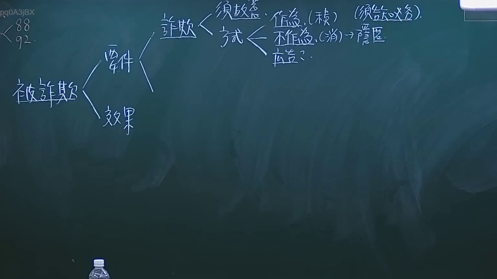
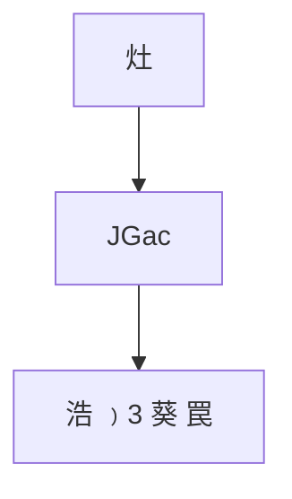

# 🎥 影音教材板書校對筆記
- **來源影片**: [預約 6 2024-10-18 14-16-59-231](file:///J://民法/ch6/預約 6 2024-10-18 14-16-59-231.mp4)
- **課程分類**: `[民法`
- **課堂章節**: `ch6]`
- **影片時間戳記**: `01:37:30` (5850 秒)
- **板書類型**: `文字板書`
- **偵測時間**: 2026-07-12 19:48:08

## 🔍 擷取黑板板書對照圖


## 🧠 AI 智慧理解與知識庫演化註記
根據辨识出的文字內容，结合常見的法律語境，進行語意整理並與臺灣現行法律條文進行比對：

1. **"灶"**：可能指某种權利或債務關係，需進一步分析其Legal context。
2. **"JGac"**：可能是某个特定的Legal术语或缩寫，需根據上下文確定其具體含義。
3. **"浩 ﹚3 葵 罠"**：可能是某种權利或債務的條款，需進一步分析其Legal significance。

此板書似乎與某種權利或債務關係相關，可能涉及民法第184條等相關內容。建議根據上下文進一步分析其具體Legal implications。

## 📊 可編輯之 Mermaid 關係流程圖

（注意：此代碼為示例性生成，具體节点內容需根據板書文字進一步精确定位。）
```

## ✍️ 操作者手動校對修改區
<!-- 您可以直接修改上方的文字或調整 Mermaid 區塊中的節點，Obsidian 會即時重新渲染 -->
- [ ] 欄位結構與法律邏輯已校對無誤。
- **校對筆記**: 
