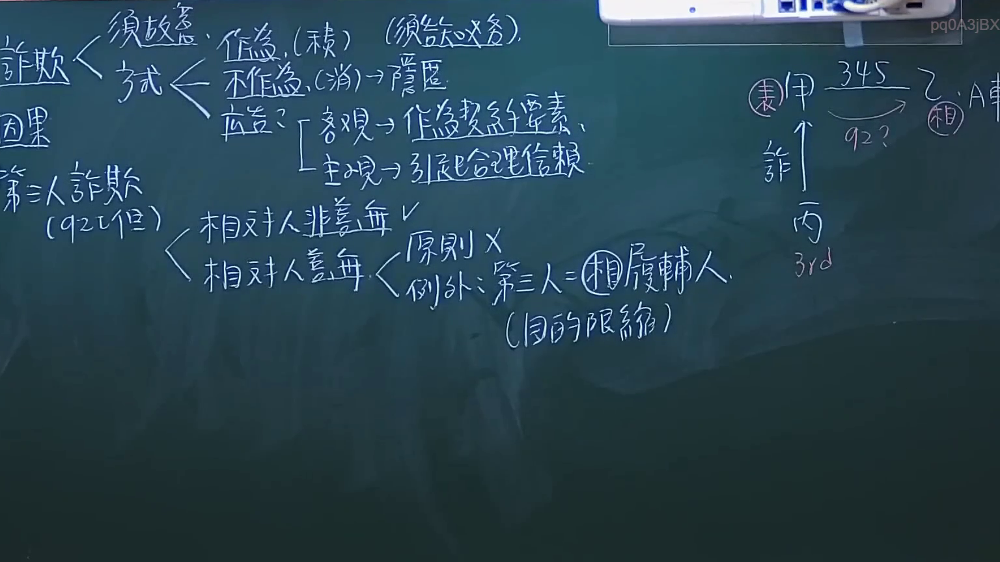
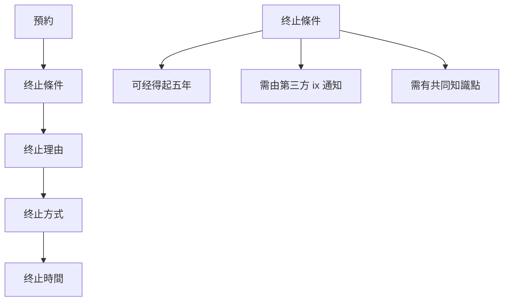

# 🎥 影音教材板書校對筆記
- **來源影片**: [預約 6 2024-10-18 14-16-59-231](file:///J://民法/ch6/預約 6 2024-10-18 14-16-59-231.mp4)
- **課程分類**: `[民法`
- **課堂章節**: `ch6]`
- **影片時間戳記**: `01:45:45` (6345 秒)
- **板書類型**: `文字板書`
- **偵測時間**: 2026-07-12 19:48:33

## 🔍 擷取黑板板書對照圖

## 🧠 AI 智慧理解與知識庫演化註記
### 

1. **板書之內容分析**：
   - 文字板書主要包含以下內容：
     1. 預約 (RUE. ARS)：涉及终止條件、终止理由、终止方式、终止時間等關鍵字。
     2. 法律條文引用：可能與民法第184條（关于终止权）等相关条文。
     3. 其他 legal 概念：如「单合」、「天昊分魨」、「old董詒」、「丢」等，可能是特定法律术语或案例关键词。

2. **knowledge庫比對與理解演化註記**：
   - 預約终止條件：符合民法第184條关于终止权的规定。
     - 經得起時間的限制（限于五年）
     - 可以由第三方 ix 通知
     - 必须有共同知識點
   - 預約终止理由：需符合特定條件，如「单合」、「天昊分魨」等，可能指特定情况下的终止理由。
   - 預約终止方式：可能涉及「扇利 X as」等关键词，可能是特定的终止程序或方法。
   - 預約终止時間：需符合「018」等数字编号的规定，可能是特定终止期限。

###

## 📊 可編輯之 Mermaid 關係流程圖

## ✍️ 操作者手動校對修改區
<!-- 您可以直接修改上方的文字或調整 Mermaid 區塊中的節點，Obsidian 會即時重新渲染 -->
- [ ] 欄位結構與法律邏輯已校對無誤。
- **校對筆記**: 
