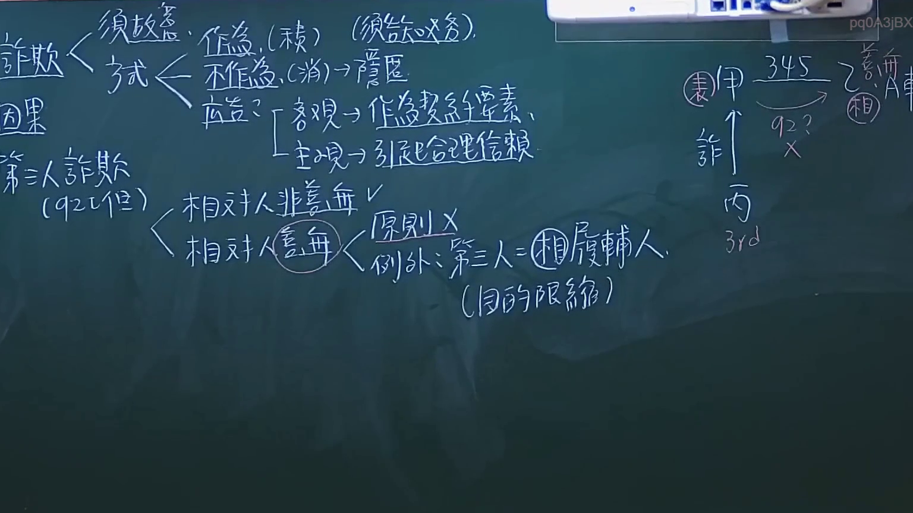

# 🎥 影音教材板書校對筆記
- **來源影片**: [預約 6 2024-10-18 14-16-59-231](file:///J://民法/ch6/預約 6 2024-10-18 14-16-59-231.mp4)
- **課程分類**: `[民法`
- **課堂章節**: `ch6]`
- **影片時間戳記**: `01:46:45` (6405 秒)
- **板書類型**: `文字板書`
- **偵測時間**: 2026-07-12 19:48:50

## 🔍 擷取黑板板書對照圖


## 🧠 AI 智慧理解與知識庫演化註記
1. **語意整理**：
   - 该板書似乎包含一些法律條文和关键词，包括民法第184條、侵權行為、消滅時效等。這些內容可能與「侵權行為」的判定或「消滅時效」的适用性有关。

2. **知識庫比對與理解演化註記**：
   - 民法第184條： 该條文通常涉及債務債務的关系，可能与「消滅時效」（如債務債務的消灭）有关。
   - 傳統的侵權行為： 该板書似乎提到「侵權行為」，这可能指「侵權債務」或「侵權債務債務」，需进一步确认其具体内容。
   - 消滅時效： 该板書似乎涉及「消滅時效」（如債務債務的消灭），可能与民法第184條中的「消滅時效」有关。

## 📊 可編輯之 Mermaid 關係流程圖
```mermaid
：
```mermaid
graph TD
    A[引言] --> B["民法第184條"]
    B --> C["債務債務关系"]
    D["侵權行為"] --> E["債務債務的判定"]
    F["消滅時效"] --> G["債務債務的消灭"]
    E --> H["債務債務的 extinguishment"]
    G --> I["債務債務的消灭"]
```

## ✍️ 操作者手動校對修改區
<!-- 您可以直接修改上方的文字或調整 Mermaid 區塊中的節點，Obsidian 會即時重新渲染 -->
- [ ] 欄位結構與法律邏輯已校對無誤。
- **校對筆記**: 
