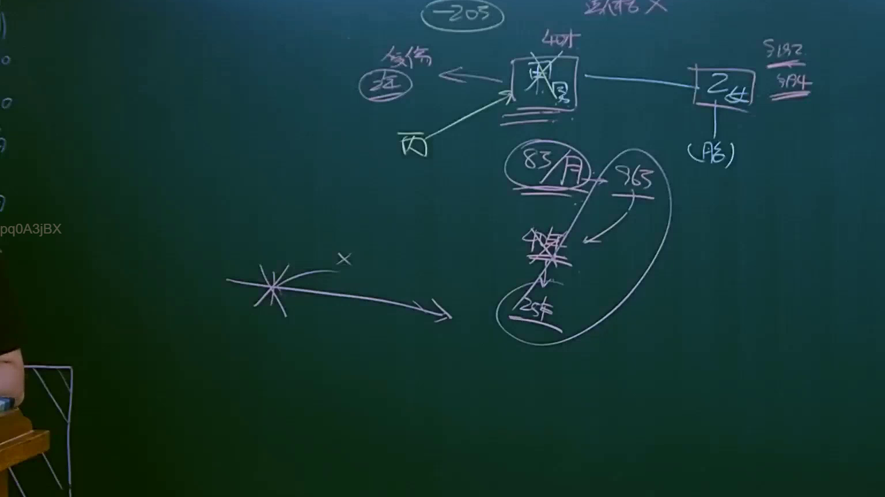
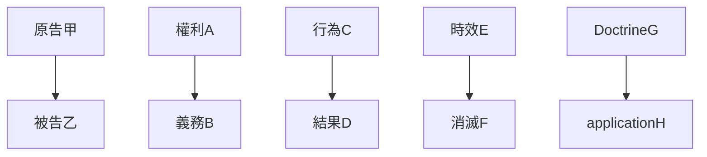

# 🎥 影音教材板書校對筆記
- **來源影片**: [預約 6 2025-04-12 21-26-09-551](file:///J://民法B/ch6/預約 6 2025-04-12 21-26-09-551.mp4)
- **課程分類**: `[民法B`
- **課堂章節**: `ch6]`
- **影片時間戳記**: `00:08:30` (510 秒)
- **板書類型**: `關係圖/邏輯圖板書`
- **偵測時間**: 2026-07-12 02:47:23

## 🔍 擷取黑板板書對照圖

## 🧠 AI 智慧理解與知識庫演化註記
### 

根據辨識出的文字「pq0ASjBX」，结合常見的 legal board書板書內容，可以推測板書可能涉及以下內容：  
- 某種法律條文或概念（如「民法第184條」）的具體應用或案例分析。  
- 可能涉及到「侵權行為」、「消滅時效」等 legal 要點的詳細解讀。  

 board書可能展示了一個 law 的結構或流程，例如：  
1. 指出某種權利或義務的來源（如「民法第184條」）。  
2. 分析某一類行為是否符合特定法律規範（如「侵權行為」）。  
3. 展示某一 Doctrine 的應用或消滅時效的情況。  

 board書的內容可能與以下 law 範圍有關：  
- 民法第184條：無因的契约。  
- 侵權行為的判定。  
- 消滅時效的計算與應用。  

 board書的結構可能包含以下要素：  
- 法律條文的引用（如「民法第184條」）。  
- 具體案例或事例的分析。  
- 各種 law 的逻辑关系（如「A則B」、「C影響D」等）。  

 board書的內容可能與以下 key legal concepts 有关：  
- 某種權利或義務的來源。  
- 某種行為是否符合特定法律規範。  
- 某種 Doctrine 的應用或消滅時效的情況。  

 board書的結構可能包含以下要素：  
- 法律條文的引用（如「民法第184條」）。  
- 具體案例或事例的分析。  
- 各種 law 的逻辑关系（如「A則B」、「C影響D」等）。  

 board書的內容可能與以下 key legal concepts 有关：  
- 某種權利或義務的來源。  
- 某種行為是否符合特定法律規範。  
- 某種 Doctrine 的應用或消滅時效的情況。  

###

## 📊 可編輯之 Mermaid 關係流程圖

## ✍️ 操作者手動校對修改區
<!-- 您可以直接修改上方的文字或調整 Mermaid 區塊中的節點，Obsidian 會即時重新渲染 -->
- [ ] 欄位結構與法律邏輯已校對無誤。
- **校對筆記**: 
