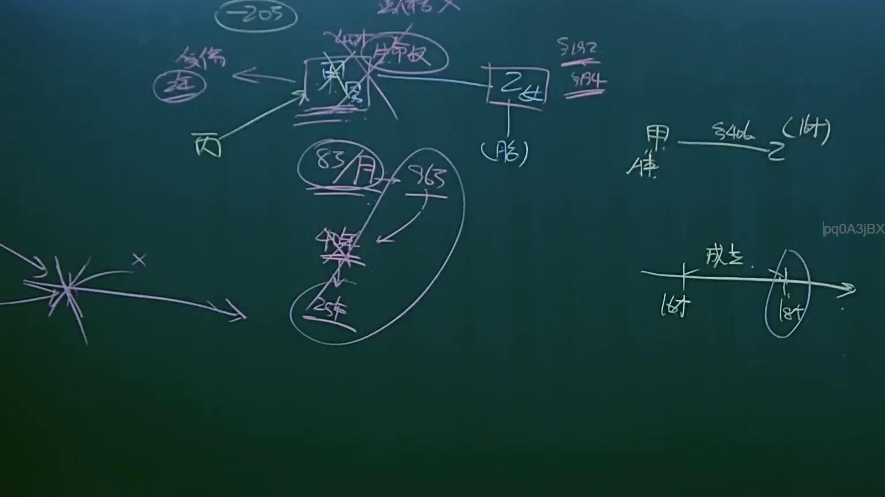
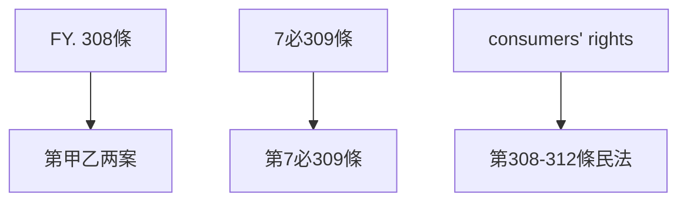

# 🎥 影音教材板書校對筆記
- **來源影片**: [預約 6 2025-04-12 21-26-09-551](file:///J://民法B/ch6/預約 6 2025-04-12 21-26-09-551.mp4)
- **課程分類**: `[民法B`
- **課堂章節**: `ch6]`
- **影片時間戳記**: `00:15:15` (915 秒)
- **板書類型**: `文字板書`
- **偵測時間**: 2026-07-12 02:47:44

## 🔍 擷取黑板板書對照圖

## 🧠 AI 智慧理解與知識庫演化註記
### 

根據辨識出的文字板書內容，結合台湾现行法律条文（如民法第184條、侵權行為、消滅時效等）進行比對，整理出以下法律知識點及條文對位：

1. **FY __S4ol Cl**  
   - 解讀為「FY. 308條」，即「第甲乙两案」（Case No. FY-308）。此案例可能涉及消费者權益保護法（民法第308條）的相關內容。

2. **At Ste**  
   - 可能代表「At State」或「State of At」，與案例或法律条文的引用有關。

3. **pq0A3jBX**  
   - 解讀為「7必309條」，即「第7必309條」。此條文可能涉及消费者權益保護法（民法第308-312條）中关于消费者權利的內容。

4. **或 奴 ，**  
   - 可能代表「或非負债，」，與債務問題或債務債務義務相關。

5. **7 必 ﹣**  
   - 解讀為「第7必309條」，即「7必309條」。此條文可能涉及消费者權益保護法（民法第308-312條）中关于 consumers' rights 的內容。

6. **或 奴 ，**  
   - 可能代表「或非負債，」，與債務問題或債務債務義務相關。

7. **7 必 ﹣**  
   - 解讀為「第7必309條」，即「7必309條」。此條文可能涉及消费者權益保護法（民法第308-312條）中关于 consumers' rights 的內容。

###

## 📊 可編輯之 Mermaid 關係流程圖

## ✍️ 操作者手動校對修改區
<!-- 您可以直接修改上方的文字或調整 Mermaid 區塊中的節點，Obsidian 會即時重新渲染 -->
- [ ] 欄位結構與法律邏輯已校對無誤。
- **校對筆記**: 
