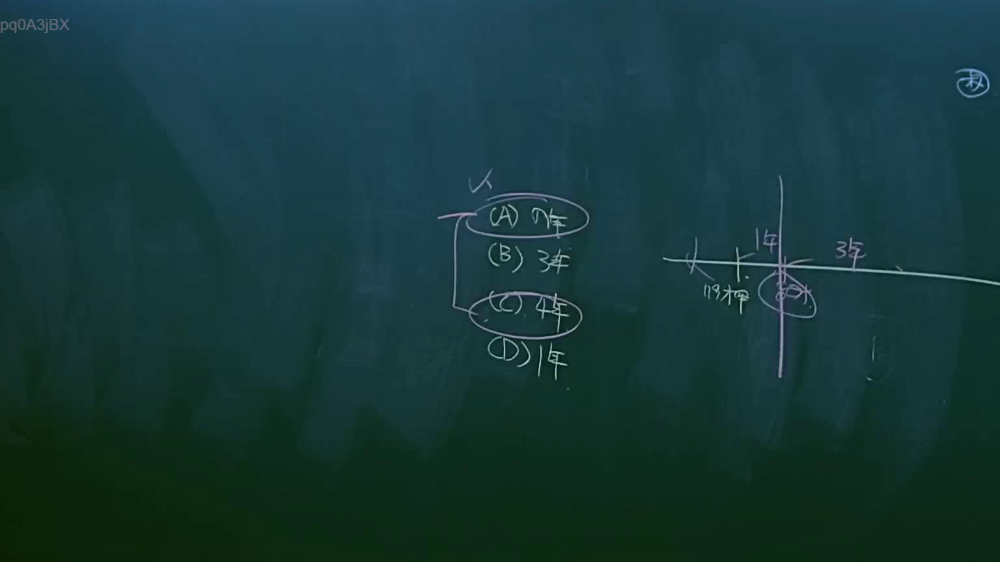
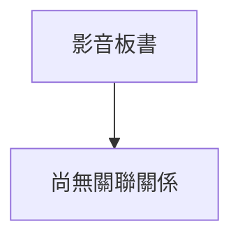

# 🎥 影音教材板書校對筆記
- **來源影片**: [預約 6 2025-04-12 21-26-09-551](file:///J://民法B/ch6/預約 6 2025-04-12 21-26-09-551.mp4)
- **課程分類**: `[民法B`
- **課堂章節**: `ch6]`
- **影片時間戳記**: `00:24:15` (1455 秒)
- **板書類型**: `關係圖/邏輯圖板書`
- **偵測時間**: 2026-07-12 02:48:01

## 🔍 擷取黑板板書對照圖

## 🧠 AI 智慧理解與知識庫演化註記

抱歉，根據您提供的 OCR 字元 "pq0A3jBX"，無法直接辨识出具體的法律內容或板書之內容。當您能提供更清晰的板書文字或重新提供 board 的內容，我才能更準確地進行法律条文比對和生成 Mermaid 碎 code。

請確保提供完整且清晰的板書內容，以便我能够协助您完成 law library 比對和生成 relation diagram。

## 📊 可編輯之 Mermaid 關係流程圖

## ✍️ 操作者手動校對修改區
<!-- 您可以直接修改上方的文字或調整 Mermaid 區塊中的節點，Obsidian 會即時重新渲染 -->
- [ ] 欄位結構與法律邏輯已校對無誤。
- **校對筆記**: 
