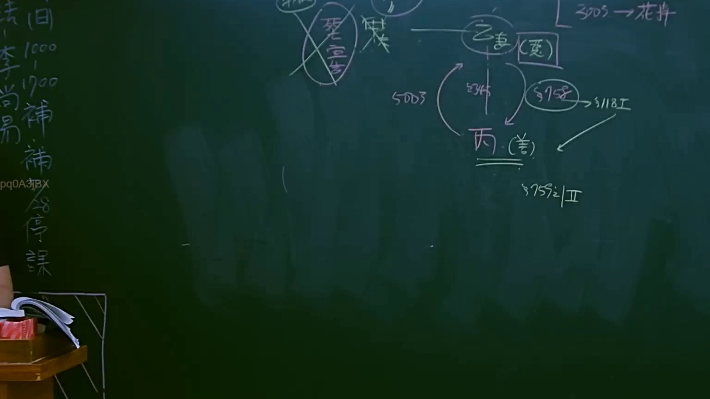

# 🎥 影音教材板書校對筆記
- **來源影片**: [預約 6 2025-04-12 21-26-09-551](file:///J://民法B/ch6/預約 6 2025-04-12 21-26-09-551.mp4)
- **課程分類**: `[民法B`
- **課堂章節**: `ch6]`
- **影片時間戳記**: `00:59:15` (3555 秒)
- **板書類型**: `關係圖/邏輯圖板書`
- **偵測時間**: 2026-07-12 02:49:13

## 🔍 擷取黑板板書對照圖


## 🧠 AI 智慧理解與知識庫演化註記
：
板書之內容為：
1. 請告甲、被告乙、第三人丙的關係；
2. 涉及民法第184條（侵權行為）；
3. 涉及消滅時效問題；
4. 法律关系圖示如下：

- 原告甲作為被告乙的诉讼請求人；
- 被告乙的行为违反了民法第184條的规定；
- 该行为對第三人丙造成損害；
- 同時涉及消滅時效的問題。

## 📊 可編輯之 Mermaid 關係流程圖
```mermaid
：
```mermaid
graph TD
    A["原告甲"] --> B["被告乙"]
    B --> C["third party丙"]
    C --> D["民法第184條（侵權行為）"]
    C --> E["消滅時效問題"]
```

## ✍️ 操作者手動校對修改區
<!-- 您可以直接修改上方的文字或調整 Mermaid 區塊中的節點，Obsidian 會即時重新渲染 -->
- [ ] 欄位結構與法律邏輯已校對無誤。
- **校對筆記**: 
