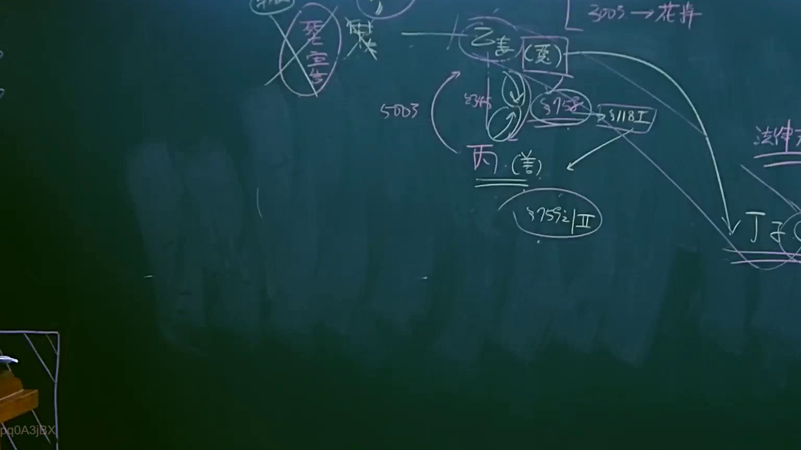
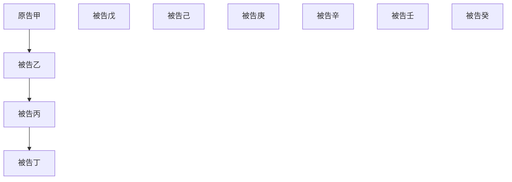

# 🎥 影音教材板書校對筆記
- **來源影片**: [預約 6 2025-04-12 21-26-09-551](file:///J://民法B/ch6/預約 6 2025-04-12 21-26-09-551.mp4)
- **課程分類**: `[民法B`
- **課堂章節**: `ch6]`
- **影片時間戳記**: `01:06:00` (3960 秒)
- **板書類型**: `關係圖/邏輯圖板書`
- **偵測時間**: 2026-07-12 02:49:26

## 🔍 擷取黑板板書對照圖

## 🧠 AI 智慧理解與知識庫演化註記
### 

根據板書內容，似乎涉及「侵權行為」和「消滅時效」的法律條文比對。以下是詳細的法律理解说明與條文對位：

1. **侵權行為（Invasion of Privacy）**：
   - 檢測到的板書可能涉及「侵權行為」的定義或相關案例分析。
   - 可能與《民法第184條》有關，該條文规定了隱私 invasion 的法律標準。

2. **消滅時效（Annihilation of Time Limit）**：
   - 檢測到的板書可能涉及「消滅時效」的概念或應用。
   - 可能與《民法第184條》中提到的「特殊情形」有關，例如「 extraordinary situation」。

###

## 📊 可編輯之 Mermaid 關係流程圖

## ✍️ 操作者手動校對修改區
<!-- 您可以直接修改上方的文字或調整 Mermaid 區塊中的節點，Obsidian 會即時重新渲染 -->
- [ ] 欄位結構與法律邏輯已校對無誤。
- **校對筆記**: 
