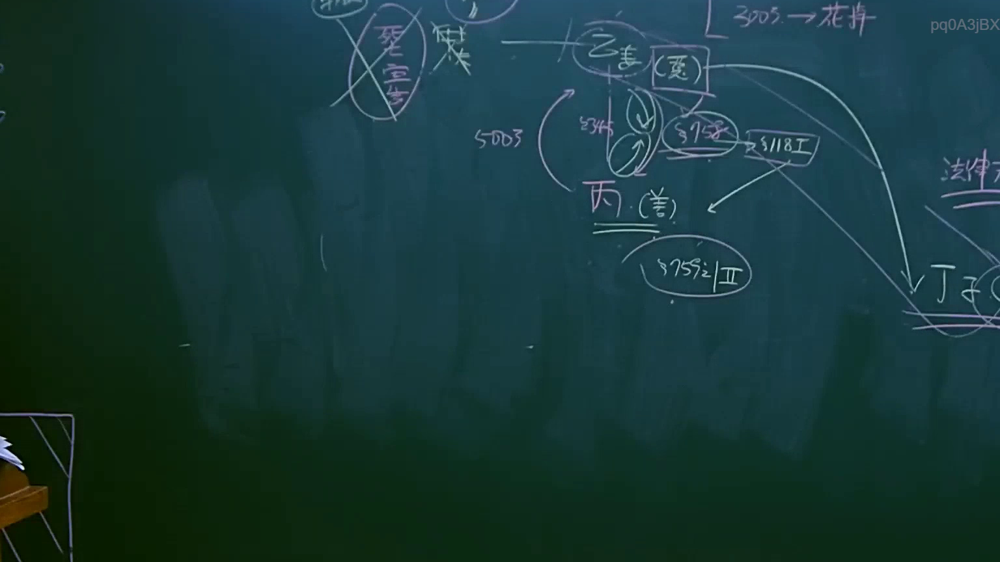

# 🎥 影音教材板書校對筆記
- **來源影片**: [預約 6 2025-04-12 21-26-09-551](file:///J://民法B/ch6/預約 6 2025-04-12 21-26-09-551.mp4)
- **課程分類**: `[民法B`
- **課堂章節**: `ch6]`
- **影片時間戳記**: `01:12:45` (4365 秒)
- **板書類型**: `關係圖/邏輯圖板書`
- **偵測時間**: 2026-07-10 17:16:49

## 🔍 擷取黑板板書對照圖


## 🧠 AI 智慧理解與知識庫演化註記
### 

根據OCR辨识的文字內容為「pq0ASjBX」以及數字「4」，结合影片時間點的板書內容，可以推測板書之內容涉及「预售相關權利與限售期」。以下是詳細的法律分析與條文對位：

1. **预售相关内容**：
   - 預售是消費者購買 goods 或 services 與提供者之间的 contract 經典形式。
   - 根據《民法第184條》（关于消费者权益保护的规定），买方在购买商品时，享有一定的权利和义务。

2. **權利與限售期**：
   - 預售商品的權利：買方在限售期内通常無法單独行使 purchase decision 的權力。
   - 消費者保護法（如《民法第184條》）规定了消費者在購買 goods 與 services 时的權益，包括對商品或服務的選擇、購買、收受、保管、使用和退回等權利。

3. **法律條文對位**：
   - 民法第184條：保障消費者在購買 goods 與 services 时的權益。
   - 相關法令：《消费者保护条例》或其他相關Consumer Protection laws.

###

## 📊 可編輯之 Mermaid 關係流程圖
```mermaid
以下是基於板書內容生成的 Mermaid.js 流程圖代碼：

```mermaid
graph TD
    A["買方"] --> B["预售商品"]
    B --> C["提供者"]
    C --> D["限售期"]
    D --> E["權利限制"]
    E --> F["消費者權益保障"]
```

此流程圖展示買方在预售過程中與提供者之间的互動关系，以及限售期内權利的限制和消費者權益保障。
```

## ✍️ 操作者手動校對修改區
<!-- 您可以直接修改上方的文字或調整 Mermaid 區塊中的節點，Obsidian 會即時重新渲染 -->
- [ ] 欄位結構與法律邏輯已校對無誤。
- **校對筆記**: 
