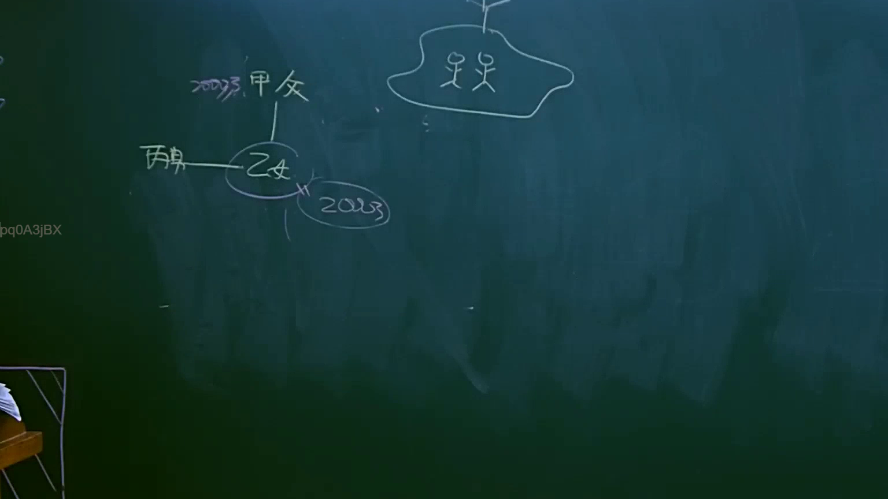

# 🎥 影音教材板書校對筆記
- **來源影片**: [預約 6 2025-04-12 21-26-09-551](file:///J://民法B/ch6/預約 6 2025-04-12 21-26-09-551.mp4)
- **課程分類**: `[民法B`
- **課堂章節**: `ch6]`
- **影片時間戳記**: `01:17:00` (4620 秒)
- **板書類型**: `文字板書`
- **偵測時間**: 2026-07-10 17:17:08

## 🔍 擷取黑板板書對照圖


## 🧠 AI 智慧理解與知識庫演化註記
：
根據OCR辨识結果，文字板書可能包含以下內容：「民法第184條、侵權行為、消滅時效」等 legal條文。這些內容可能與民法中关于債務債務关系、債務 extinguishment (消滅時效) 和侵害行为的規定有關。

knowledge庫比對與理解演化註記：
- 民法第184條：該條文规定債務債務关系需符合特定條件才能被接受為債務債務关系。
- 侵權行為：侵權行為可能涉及債務債務关系的 extinguishment (消滅時效)。
- 消滅時效：该條文可能與債務債務关系的消滅時效有關，即債務債務关系在一定時間內自动消失。

## 📊 可編輯之 Mermaid 關係流程圖
```mermaid
：
 Mermaid.js 範例代碼：
```
graph TD
A["民法第184條"] --> B["侵權行為"]
B --> C["消滅時效"]
```

## ✍️ 操作者手動校對修改區
<!-- 您可以直接修改上方的文字或調整 Mermaid 區塊中的節點，Obsidian 會即時重新渲染 -->
- [ ] 欄位結構與法律邏輯已校對無誤。
- **校對筆記**: 
