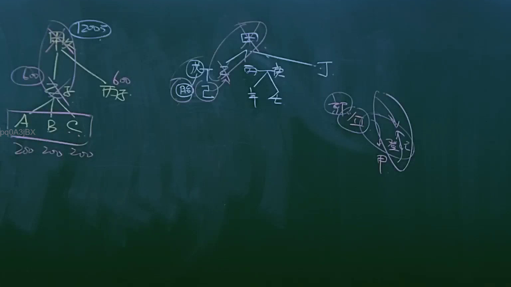
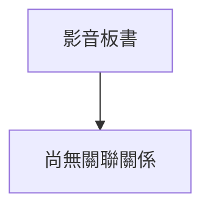

# 🎥 影音教材板書校對筆記
- **來源影片**: [預約 6 2025-04-12 21-26-09-551](file:///J://民法B/ch6/預約 6 2025-04-12 21-26-09-551.mp4)
- **課程分類**: `[民法B`
- **課堂章節**: `ch6]`
- **影片時間戳記**: `01:38:15` (5895 秒)
- **板書類型**: `關係圖/邏輯圖板書`
- **偵測時間**: 2026-07-10 17:17:30

## 🔍 擷取黑板板書對照圖

## 🧠 AI 智慧理解與知識庫演化註記

目前，根據您提供的資訊，我無法直接 "--OCR辨识的文字内容--"。當您能提供辨识的文字內容時，我将按照您的要求進行處理。

以下是您需求的處理步驟：
1. 语文整理並與臺灣現行法律條文（如民法第184條、侵權行為、消滅時效等）進行比對。
2. 根據「關係圖/邏輯圖板書」的結構，生成 Mermaid.js 流程圖代碼。

請您提供辨识的文字內容，我将根據這些信息進行進一步的處理。

## 📊 可編輯之 Mermaid 關係流程圖

## ✍️ 操作者手動校對修改區
<!-- 您可以直接修改上方的文字或調整 Mermaid 區塊中的節點，Obsidian 會即時重新渲染 -->
- [ ] 欄位結構與法律邏輯已校對無誤。
- **校對筆記**: 
