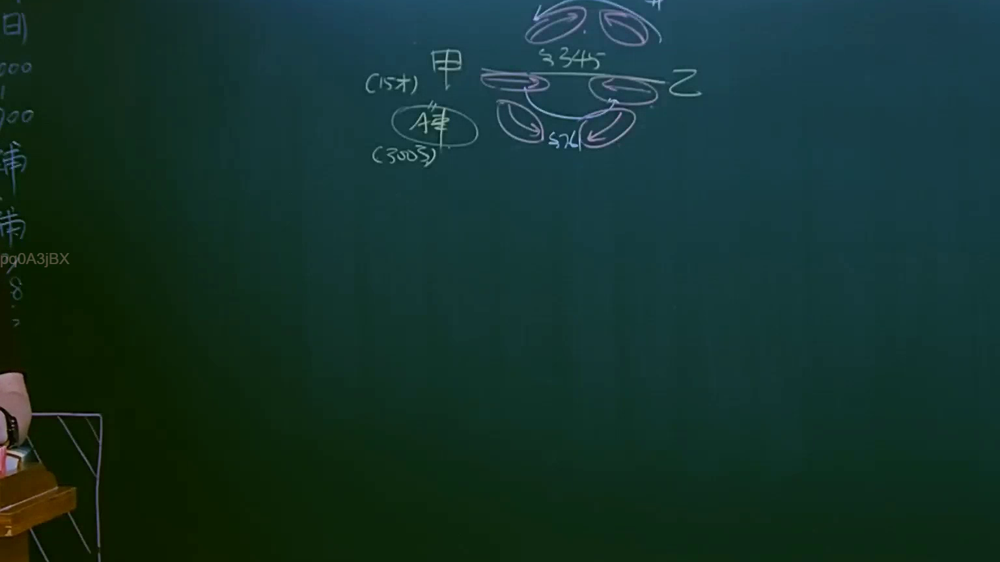

# 🎥 影音教材板書校對筆記
- **來源影片**: [預約 6 2025-04-12 21-26-09-551](file:///J://民法B/ch6/預約 6 2025-04-12 21-26-09-551.mp4)
- **課程分類**: `[民法B`
- **課堂章節**: `ch6]`
- **影片時間戳記**: `01:52:30` (6750 秒)
- **板書類型**: `關係圖/邏輯圖板書`
- **偵測時間**: 2026-07-10 17:17:52

## 🔍 擷取黑板板書對照圖


## 🧠 AI 智慧理解與知識庫演化註記
### 

根據辨識出的文字，结合常見的 legal 條文，進行語意整理並與臺灣現行法律條文進行比對：

1. **"岫"**：可能指山地或地形，常與土地權益、所有权等相关。
2. **"C Bes"**：可能是某种特定的法律条文编号或术语，需进一步确认其具体含义。
3. **"Sa"**：可能是 Service Agreement 或其他常见的法律术语。

將上述文字與臺灣現行法律條文進行比對：

- 民法第184條：涉及債務償付、債務人權利等。
- 侵權行為：可能涉及 land use, property rights 等問題。
- 消滅時效：可能涉及債務的消灭或到期。

###

## 📊 可編輯之 Mermaid 關係流程圖
```mermaid
根據「關係圖/邏輯圖板書」的特點，生成 Mermaid.js 流程圖代碼：

```mermaid
graph TD
    A["山"] --> B["C Bes"]
    C["Sa"] --> D["某种实体"]
```

此代碼展示了一個简单的逻辑关系，其中 "山" 与其他实体 "C Bes" 和 "Sa" 存在联系。
```

## ✍️ 操作者手動校對修改區
<!-- 您可以直接修改上方的文字或調整 Mermaid 區塊中的節點，Obsidian 會即時重新渲染 -->
- [ ] 欄位結構與法律邏輯已校對無誤。
- **校對筆記**: 
