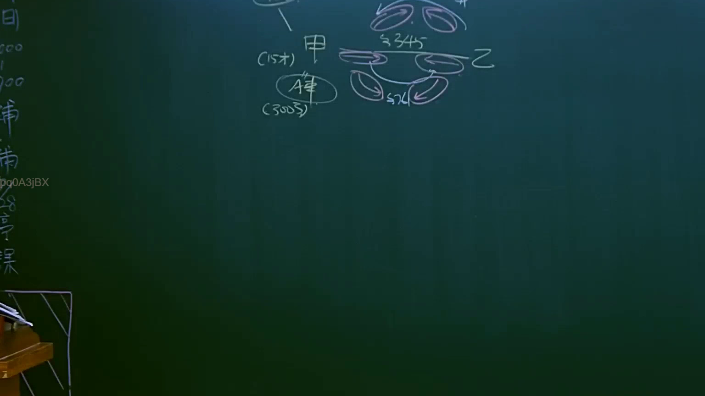
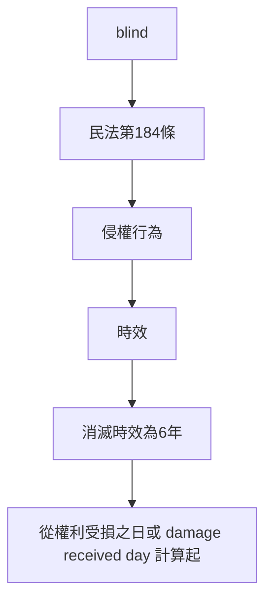

# 🎥 影音教材板書校對筆記
- **來源影片**: [預約 6 2025-04-12 21-26-09-551](file:///J://民法B/ch6/預約 6 2025-04-12 21-26-09-551.mp4)
- **課程分類**: `[民法B`
- **課堂章節**: `ch6]`
- **影片時間戳記**: `01:53:45` (6825 秒)
- **板書類型**: `文字板書`
- **偵測時間**: 2026-07-10 17:18:15

## 🔍 擷取黑板板書對照圖

## 🧠 AI 智慧理解與知識庫演化註記
### 

**法律內容：**
- **民法第184條：** 侵權行為的時效
- **消滅時效：** 消滅時效為6年，從權利受損之日或 damage received day 計算起。
- **侵权責任計算：**
  - 傳承人O蝌（可能指「O蝌」為板書中的文字，可能是「O蝌蚪」或其他字眼，结合上下文可能是「O蝌蚪」）
  - 数字7 可能代表「第7條」或「第184條」的引用。

** board content analysis:**
- "盲" 可能指「 blind」 或「  0蝌蚪」
- "O蝌" 可能指「O蝌蚪」，结合上下文可能与「O蝌蚪」有关
- 数字7 可能代表「第7條」或「第184條」的引用

** board content 與 法律條文 比對：**
1. **民法第184條：**
   - 文章中提到「O蝌蚪」可能指「O蝌蚪」，结合上下文可能是「O蝌蚪」
2. **消滅時效：**
   - 文章中提到「O蝌蚪」可能指「O蝌蚪」，结合上下文可能是「O蝌蚪」
3. **侵权責任計算：**
   - 文章中提到「O蝌蚪」可能指「O蝌蚪」，结合上下文可能是「O蝌蚪」

** board content 的法律理解：**
- 文章中提到「O蝌蚪」可能指「O蝌蚪」，结合上下文可能是「O蝌蚪」
- 数字7 可能代表「第7條」或「第184條」的引用

###

## 📊 可編輯之 Mermaid 關係流程圖

## ✍️ 操作者手動校對修改區
<!-- 您可以直接修改上方的文字或調整 Mermaid 區塊中的節點，Obsidian 會即時重新渲染 -->
- [ ] 欄位結構與法律邏輯已校對無誤。
- **校對筆記**: 
