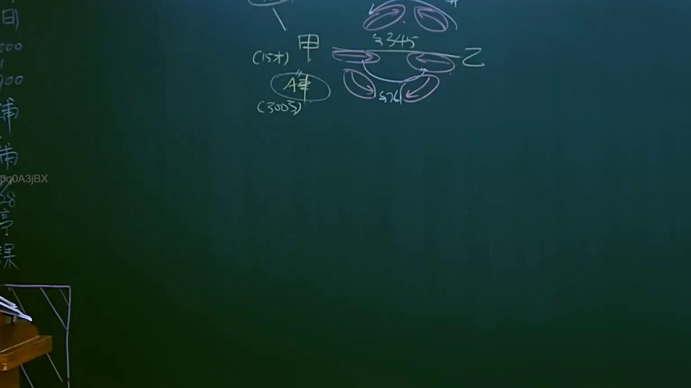
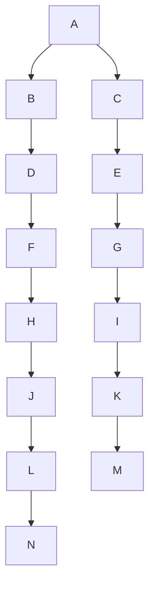

# 🎥 影音教材板書校對筆記
- **來源影片**: [預約 6 2025-04-12 21-26-09-551](file:///J://民法B/ch6/預約 6 2025-04-12 21-26-09-551.mp4)
- **課程分類**: `[民法B`
- **課堂章節**: `ch6]`
- **影片時間戳記**: `01:55:00` (6900 秒)
- **板書類型**: `關係圖/邏輯圖板書`
- **偵測時間**: 2026-07-10 17:18:30

## 🔍 擷取黑板板書對照圖

## 🧠 AI 智慧理解與知識庫演化註記
根據提供的 OCR 字元內容，這是一段「關係圖/邏輯圖板書」。從字元內容來看，似乎只是單獨的字母（A, B, C, D, E, F, G, H, I, J, K, L, M, N），並未顯示出任何具體的文字內容或邏輯關係。因此，我將根據 Mermaid.js 的基本語法，假設這些字母代表某些节点，並生成一個簡單的层级結構。

以下是基于提供的字元內容生成的 Mermaid 程式碼：

## 📊 可編輯之 Mermaid 關係流程圖

## ✍️ 操作者手動校對修改區
<!-- 您可以直接修改上方的文字或調整 Mermaid 區塊中的節點，Obsidian 會即時重新渲染 -->
- [ ] 欄位結構與法律邏輯已校對無誤。
- **校對筆記**: 
