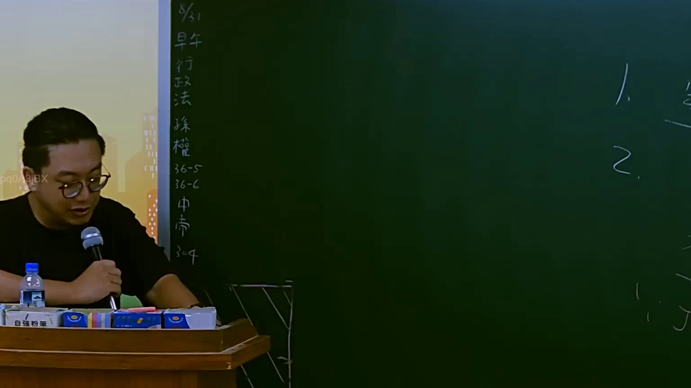
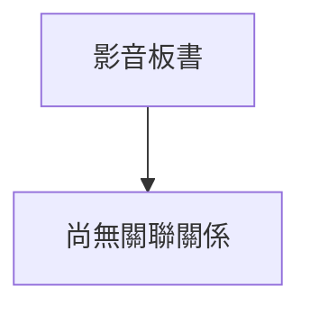

# 🎥 影音教材板書校對筆記
- **來源影片**: [預約 6 2025-07-23 17-05-56-597](file:///J://行政法A/ch6/預約 6 2025-07-23 17-05-56-597.mp4)
- **課程分類**: `[行政法A`
- **課堂章節**: `ch6]`
- **影片時間戳記**: `00:42:15` (2535 秒)
- **板書類型**: `關係圖/邏輯圖板書`
- **偵測時間**: 2026-07-13 12:11:33

## 🔍 擷取黑板板書對照圖

## 🧠 AI 智慧理解與知識庫演化註記
：

您好，您提供的訊息中「擷取區域的 OCR 辨識字元如下：」之後**沒有實際的文字內容**。我無法看到老師在黑板上書寫了什麼板書文字。

請您補充以下任一資訊，我再為您完成分析：

1. **直接貼上 OCR 辨識出的文字**（即使有錯別字也沒關係）
2. **描述板書的大致結構與關鍵字**（例如：「左邊寫『侵權行為』，右邊畫了兩個框分別標『故意』和『過失』，中間用箭頭連接」）

一旦我拿到文字內容，我會立即為您完成：
- 語意整理與臺灣現行法律條文比對（民法第184條、消滅時效等）
- 生成對應的 Mermaid.js 流程圖代碼

請補充 OCR 文字或板書描述，謝謝！

## 📊 可編輯之 Mermaid 關係流程圖

## ✍️ 操作者手動校對修改區
<!-- 您可以直接修改上方的文字或調整 Mermaid 區塊中的節點，Obsidian 會即時重新渲染 -->
- [ ] 欄位結構與法律邏輯已校對無誤。
- **校對筆記**: 
