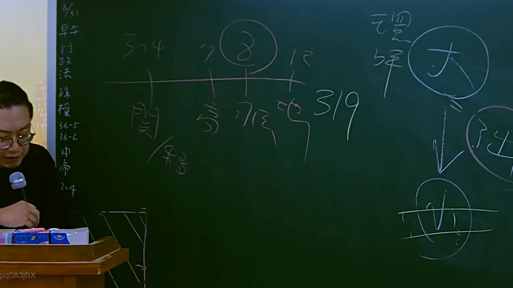
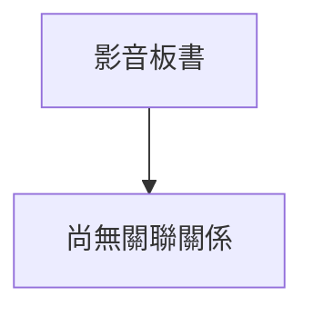

# 🎥 影音教材板書校對筆記
- **來源影片**: [預約 6 2025-07-23 17-05-56-597](file:///J://行政法A/ch6/預約 6 2025-07-23 17-05-56-597.mp4)
- **課程分類**: `[行政法A`
- **課堂章節**: `ch6]`
- **影片時間戳記**: `01:14:15` (4455 秒)
- **板書類型**: `關係圖/邏輯圖板書`
- **偵測時間**: 2026-07-13 12:12:25

## 🔍 擷取黑板板書對照圖

## 🧠 AI 智慧理解與知識庫演化註記
：

⚠️ **OCR 辨識字元未收到**：您提供的訊息中，「擷取區域的 OCR 辨識字元如下」之後為空白，未能接收到實際的文字內容。因此我無法進行語意整理、條文比對或生成對應圖表。

請您重新提供以下任一格式的內容，我再為您完成分析：

1. **直接貼上 OCR 辨識出的文字**（例如：「甲請求乙賠償...」等）
2. **描述黑板上的圖畫結構**（例如：左側是原告、右側是被告、中間有箭頭連接等）
3. **上傳截圖檔案**，我將自行進行 OCR 辨識

---

一旦收到文字內容後，我會立即為您完成：

- 📖 **語意整理與條文比對**（民法第184條侵權行為責任、消滅時效、契約效力等）
- 🔗 **Mermaid.js 關係圖/邏輯圖代碼**（含雙引號包裹節點文字，符合語法規範）

請補充資訊後再發一次即可。

## 📊 可編輯之 Mermaid 關係流程圖

## ✍️ 操作者手動校對修改區
<!-- 您可以直接修改上方的文字或調整 Mermaid 區塊中的節點，Obsidian 會即時重新渲染 -->
- [ ] 欄位結構與法律邏輯已校對無誤。
- **校對筆記**: 
