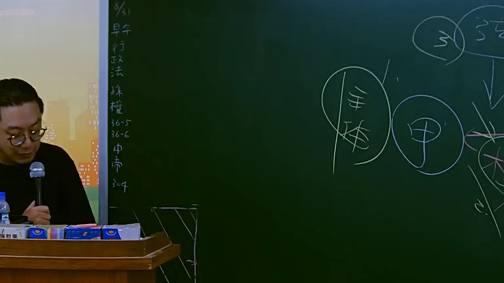

# 🎥 影音教材板書校對筆記
- **來源影片**: [預約 6 2025-07-23 17-05-56-597](file:///J://行政法A/ch6/預約 6 2025-07-23 17-05-56-597.mp4)
- **課程分類**: `[行政法A`
- **課堂章節**: `ch6]`
- **影片時間戳記**: `01:37:30` (5850 秒)
- **板書類型**: `關係圖/邏輯圖板書`
- **偵測時間**: 2026-07-13 12:12:52

## 🔍 擷取黑板板書對照圖


## 🧠 AI 智慧理解與知識庫演化註記
：
您好，您的請求中「擷取區域的 OCR 辨識字元」部分為空白，未提供實際的文字內容。我無法在沒有板書文字的情況下進行語意整理、法律條文比對（如民法第184條侵權行為責任、消滅時效等）以及生成 Mermaid.js 流程圖。

請您補充以下資訊後我再為您完成：
1. **OCR 辨識出的具體字元**（例如老師在黑板上寫下的文字內容）
2. （如有）該段板書對應的法律主題或情境描述

一旦收到完整資料，我將立即為您提供：
- ：語意整理 + 臺灣現行法律條文比對與知識演化註記
-

## 📊 可編輯之 Mermaid 關係流程圖
```mermaid
：完整的 Mermaid.js 流程圖程式碼（節點文字以雙引號括住）

期待您的補充！
```

## ✍️ 操作者手動校對修改區
<!-- 您可以直接修改上方的文字或調整 Mermaid 區塊中的節點，Obsidian 會即時重新渲染 -->
- [ ] 欄位結構與法律邏輯已校對無誤。
- **校對筆記**: 
