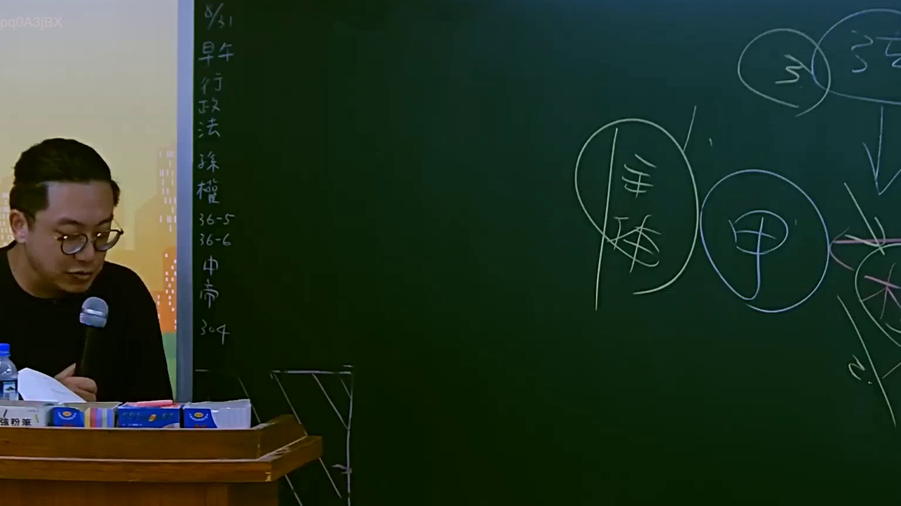
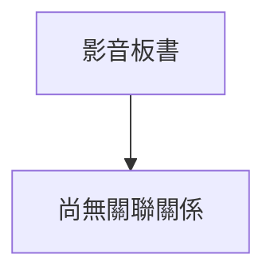

# 🎥 影音教材板書校對筆記
- **來源影片**: [預約 6 2025-07-23 17-05-56-597](file:///J://行政法A/ch6/預約 6 2025-07-23 17-05-56-597.mp4)
- **課程分類**: `[行政法A`
- **課堂章節**: `ch6]`
- **影片時間戳記**: `01:38:15` (5895 秒)
- **板書類型**: `關係圖/邏輯圖板書`
- **偵測時間**: 2026-07-13 12:13:14

## 🔍 擷取黑板板書對照圖

## 🧠 AI 智慧理解與知識庫演化註記
：

您好，感謝您的提問。不過我注意到您訊息中「擷取區域的 OCR 辨識字元如下：」之後**並未附上實際的 OCR 文字內容**。目前板書文字為空白，因此我無法進行以下工作：

1. **語意整理與條文比對** — 無文字可分析
2. **Mermaid.js 流程圖生成** — 無結構可依繪製

---

請您將 OCR 辨識出的板書字元重新貼上（例如：「民法第184條、侵權行為責任構成要件...」等），我收到後會立即為您完成：

- 📖 **知識庫比對與理解演化註記**（對照民法、消滅時效、侵權行為等現行法條）
- 🌳 **Mermaid.js 關係圖/邏輯樹代碼**（依板書結構自動生成，節點文字以雙引號包裹）

期待您的補充！

## 📊 可編輯之 Mermaid 關係流程圖

## ✍️ 操作者手動校對修改區
<!-- 您可以直接修改上方的文字或調整 Mermaid 區塊中的節點，Obsidian 會即時重新渲染 -->
- [ ] 欄位結構與法律邏輯已校對無誤。
- **校對筆記**: 
