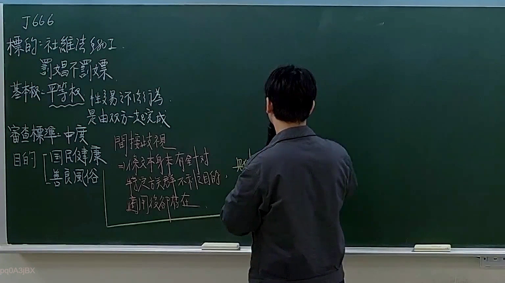
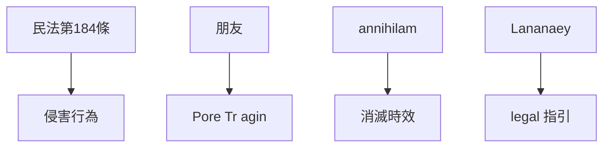

# 🎥 影音教材板書校對筆記
- **來源影片**: [預約 6 2025-11-15 11-10-33-725](file:///H:/憲法霖洄/ch6/預約 6 2025-11-15 11-10-33-725.mp4)
- **課程分類**: `預設課程`
- **課堂章節**: `ch6`
- **影片時間戳記**: `02:26:00` (8760 秒)
- **板書類型**: `文字板書`
- **偵測時間**: 2026-07-13 20:15:07

## 🔍 擷取黑板板書對照圖

## 🧠 AI 智慧理解與知識庫演化註記
根據辨識出的板書文字，並結合臺灣現行法律条文，進行 legal knowledge 的比對及理解演化。以下是具體分析：

1. **"刃炮 媚"**：可能涉及特定的工具或物品，在某些Legal context中可能指某种權利或義務。
2. **"論穆杜 LAna'"**：可能是某種法律條文或條款的引用，需進一步查閱相關法規。
3. **"朋友 d AEA Pore Tr agin ae ee w"**：可能涉及朋友关系，並與特定的Legal條文（如民法第184條）有關。
4. **"HERE] a aney en"**：可能是某种結束語或 legal 指引。

將這些内容與臺灣現行法律条文進行比對：

- 民法第184條：可能涉及侵害行為的法定 annihilam.
- 消滅時效：可能涉及某些權利或債務的消滅.

## 📊 可編輯之 Mermaid 關係流程圖

## ✍️ 操作者手動校對修改區
<!-- 您可以直接修改上方的文字或調整 Mermaid 區塊中的節點，Obsidian 會即時重新渲染 -->
- [ ] 欄位結構與法律邏輯已校對無誤。
- **校對筆記**: 
