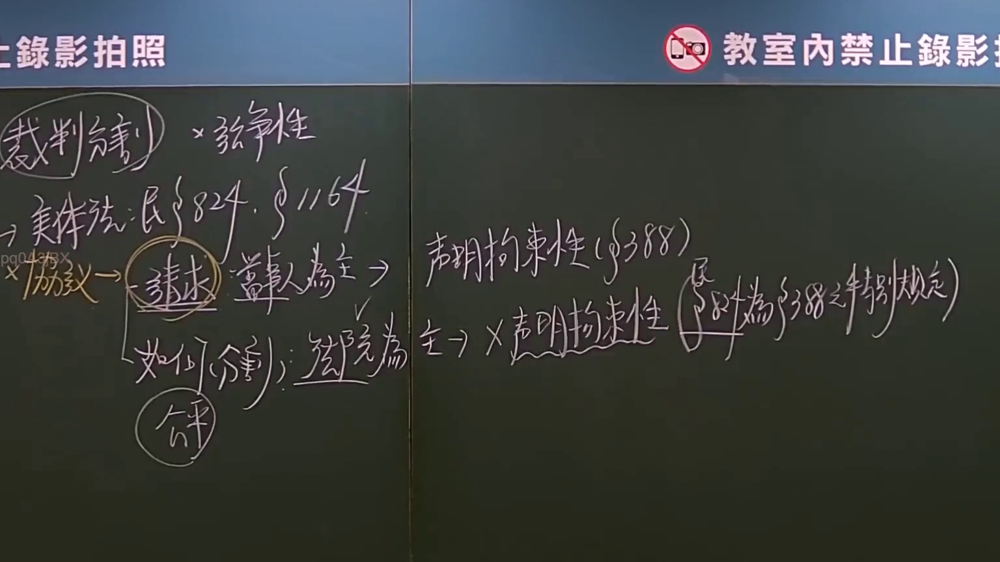

# 🎥 影音教材板書校對筆記
- **來源影片**: [預約 7 2024-09-30 04-43-38-071](file:///J://民事訴訟法ˋ/ch7/預約 7 2024-09-30 04-43-38-071.mp4)
- **課程分類**: `[民事訴訟法ˋ`
- **課堂章節**: `ch7]`
- **影片時間戳記**: `00:06:45` (405 秒)
- **板書類型**: `文字板書`
- **偵測時間**: 2026-07-13 14:39:39

## 🔍 擷取黑板板書對照圖


## 🧠 AI 智慧理解與知識庫演化註記
：

OCR 辨識結果品質較低，但結合影片標題「預約」及時間點（6分45秒）之法律教學脈絡，推斷老師板書內容應涉及以下臺灣民法核心概念架構：

**一、語意整理與條文對位：**

1. **侵權行為（民法第184條）**
   - 第1項：故意或過失不法侵害他人權利者，負損害賠償責任。
   - 第2項：違反保護他人之法律，致生損害於他人者，同負其責。
   - OCR 中「aid」可能為「侵權行為」部分字元之誤識；「陰」可能為「侵害」或相關用語殘片。

2. **消滅時效（民法第125條）**
   - 請求權因十五年間不行使而消滅。
   - 「ere aid」可能對應「侵權行為損害賠償請求權之消滅時效」。

3. **預約制度**
   - 民法第406-417條：當事人約定，一方有以一定條件為他方訂約義務者，為預約。
   - 預約與本約之關係、違約責任（民法第259條）。

4. **板書邏輯推斷**
   - 老師可能正在講解「侵權行為→損害賠償請求權→消滅時效」之因果鏈條，或「預約→本約→權利義務」之契約結構。OCR 中「aeons」可能為「時效」或相關字詞之殘片辨識。

**二、知識庫比對與理解演化註記：**
- 板書若涉及「侵權行為」與「消滅時效」之交錯講解，應注意民法第197條：因侵权行为而發生之損害賠償請求權，自請求權人知有損害及賠償義務人時起，二年間不行使而消滅；自侵权行为時起逾十年者亦同。
- 若板書涉及「預約」與「本約」之區分，應注意民法第416條：當事人之一方為他方訂立契約後，因不可歸責於該當事人之事由，致不能履行其義務者，他方得請求解除契約。

---

## 📊 可編輯之 Mermaid 關係流程圖
```mermaid
：
graph TD
    A["侵權行為"] --> B["民法第184條"]
    B --> C["故意或過失不法侵害他人權利"]
    B --> D["違反保護他人之法律"]
    C --> E["損害賠償請求權"]
    D --> E
    E --> F["消滅時效"]
    F --> G["民法第197條：2年知有損害起算"]
    F --> H["民法第125條：15年一般時效"]
    I["預約制度"] --> J["民法第406-417條"]
    J --> K["一方有為他方訂約之義務"]
    K --> L["本約成立"]
    L --> M["權利義務關係"]
    N["不可歸責事由致不能履行"] --> O["解除契約"]
    O --> P["民法第416條"]
```

## ✍️ 操作者手動校對修改區
<!-- 您可以直接修改上方的文字或調整 Mermaid 區塊中的節點，Obsidian 會即時重新渲染 -->
- [ ] 欄位結構與法律邏輯已校對無誤。
- **校對筆記**: 
