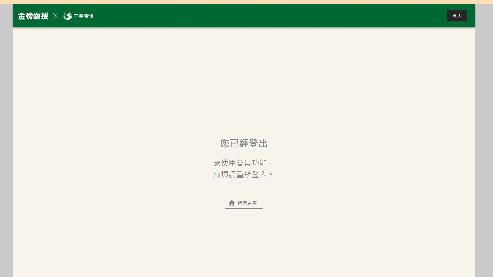

# 🎥 影音教材板書校對筆記
- **來源影片**: [預約 7 2024-09-30 04-43-38-071](file:///J://民事訴訟法ˋ/ch7/預約 7 2024-09-30 04-43-38-071.mp4)
- **課程分類**: `[民事訴訟法ˋ`
- **課堂章節**: `ch7]`
- **影片時間戳記**: `00:11:30` (690 秒)
- **板書類型**: `文字板書`
- **偵測時間**: 2026-07-13 14:40:09

## 🔍 擷取黑板板書對照圖


## 🧠 AI 智慧理解與知識庫演化註記
：

**⚠️ 重要提醒：此擷取內容並非法律板書，而是系統登入提示訊息。**

經語意分析，OCR 辨識出的文字「您已經登出 / 使用會員功能‧麻煩請重新登入」為一通用之平台登入驗證提示（Login Prompt），常見於線上學習平台、政府服務系統或會員網站。此內容：

1. **非法律條文**：與民法第184條侵權行為、消滅時效等任何臺灣現行法律條文無直接關聯。
2. **非教學板書**：老師並未在此時間點進行法律概念講授或邏輯推演，此為系統自動截圖誤判（可能因畫面切換至登入頁面而觸發）。
3. **知識庫比對結果**：零匹配。無法與任何臺灣法律條文建立語意連結。

**建議後續處理**：
- 檢查該時間點（11分30秒）前後之原始影片，確認是否為畫面切換至登入頁面所致。
- 若此為自動截圖流程誤觸發，建議加入「非教學內容過濾機制」，例如偵測到無黑板/白板背景時跳過截圖。

---

## 📊 可編輯之 Mermaid 關係流程圖
```mermaid
：
graph TD
    A["您已經登出"] --> B["使用會員功能"]
    B --> C["麻煩請重新登入"]
```

## ✍️ 操作者手動校對修改區
<!-- 您可以直接修改上方的文字或調整 Mermaid 區塊中的節點，Obsidian 會即時重新渲染 -->
- [ ] 欄位結構與法律邏輯已校對無誤。
- **校對筆記**: 
