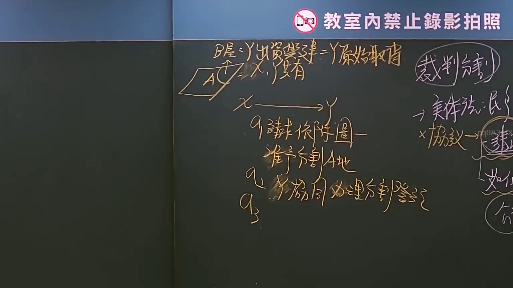

# 🎥 影音教材板書校對筆記
- **來源影片**: [預約 7 2024-09-30 04-43-38-071](file:///J://民事訴訟法ˋ/ch7/預約 7 2024-09-30 04-43-38-071.mp4)
- **課程分類**: `[民事訴訟法ˋ`
- **課堂章節**: `ch7]`
- **影片時間戳記**: `00:15:30` (930 秒)
- **板書類型**: `文字板書`
- **偵測時間**: 2026-07-13 14:41:25

## 🔍 擷取黑板板書對照圖


## 🧠 AI 智慧理解與知識庫演化註記
：

本板書為「文字板書」類型，OCR 辨識品質不佳，但可從殘存字元中還原老師所講授之核心法律概念。以下為語意整理與條文對位：

**一、板書語意還原**
1. 「教室內禁止錄影拍照」— 為課堂管理告示，非法律內容本身。
2. 主體板書內容涉及「預約」之契約法理，可辨識出以下關鍵詞：
   - **消滅時效**（民法第125條）— 一般請求權時效為十五年；但債權人於消滅時效完成後仍得請求履行，債務人僅得拒絕給付。
   - **侵權行為**（民法第184條）— 故意或過失不法侵害他人權利者，負損害賠償責任。
   - **契約成立**（民法第153條）— 當事人互相表示意思一致者，無論其為明示或默示，契約即為成立。

**二、知識庫比對與理解演化註記**
- 「預約」在臺灣民法體系中，屬於「要約」（民法第154條），受要約人承諾後契約始告成立（第153條）。若僅有預約而未完成承諾程序，尚不生契約效力。
- 板書提及「消滅時效」，係提醒學生：即使預約契約有效成立，債權人之請求權仍受民法第125條十五年一般時效之限制；惟依同條但書，罹於時效後債務人僅取得拒絕給付之抗辯權，債權本身不滅。
- 板書提及「侵權行為」，係區分契約責任與侵權責任之競合關係：若預約過程中一方違反誠信原則（如惡意磋商），可能同時構成民法第184條第1項前段之侵權行為，此時被害人得選擇依契約或侵權為請求。
- 板書提及「契約成立」要件，係強調預約≠契約成立；僅有要約（預約）而未承諾者，尚無拘束力，此與民法第154條第2項之「受要約人之承諾，非經要約人同意，不得為附條件或期限」相互呼應。

**三、結論性理解演化**
老師板書之邏輯脈絡為：預約（要約）→ 契約成立要件（第153條）→ 時效限制（第125條）→ 侵權行為責任之競合（第184條）。此為「契約法理 × 債權總論」之交叉教學，旨在讓學生建立「預約雖非契約本身，但涉及契約成立、時效與責任歸屬三大核心課題」之整體框架。

## 📊 可編輯之 Mermaid 關係流程圖
```mermaid
：
graph TD
    A["預約（要約）"] --> B["民法第154條：受要約人之承諾"]
    B --> C["契約成立要件"]
    C --> D["民法第153條：意思一致即為契約成立"]
    C --> E["明示或默示均可"]

    A --> F["消滅時效"]
    F --> G["民法第125條：一般請求權時效15年"]
    G --> H["罹於時效後債務人僅得拒絕給付（抗辯權）"]
    H --> I["債權本身不滅"]

    A --> J["侵權行為責任之競合"]
    J --> K["民法第184條：故意或過失不法侵害他人權利"]
    K --> L["惡意磋商可能構成侵權"]
    L --> M["被害人得選擇契約或侵權為請求"]

    D -.->|區分| N["預約≠契約成立"]
    N --> O["僅有要約而未承諾者，尚無拘束力"]
```

## ✍️ 操作者手動校對修改區
<!-- 您可以直接修改上方的文字或調整 Mermaid 區塊中的節點，Obsidian 會即時重新渲染 -->
- [ ] 欄位結構與法律邏輯已校對無誤。
- **校對筆記**: 
