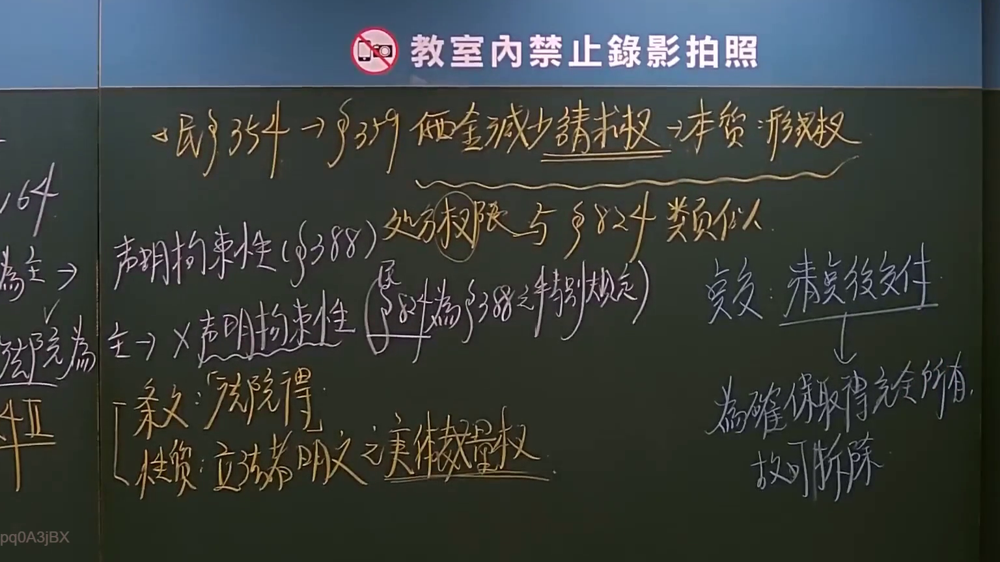

# 🎥 影音教材板書校對筆記
- **來源影片**: [預約 7 2024-09-30 04-43-38-071](file:///J://民事訴訟法ˋ/ch7/預約 7 2024-09-30 04-43-38-071.mp4)
- **課程分類**: `[民事訴訟法ˋ`
- **課堂章節**: `ch7]`
- **影片時間戳記**: `00:22:45` (1365 秒)
- **板書類型**: `文字板書`
- **偵測時間**: 2026-07-13 14:42:17

## 🔍 擷取黑板板書對照圖


## 🧠 AI 智慧理解與知識庫演化註記
：

**⚠️ OCR 辨識品質警示：**
本次截圖之 OCR 辨識結果品質極差，大量字元為亂碼（如「炖」「炔」「氡」等無意義字符），僅能辨識出零星關鍵字：「刑」「物」「科」。此類情形常見於以下原因：
1. 黑板書寫筆跡潦草或顏色與背景對比度不足
2. OCR 引擎對繁體中文手寫體識別率低
3. 截圖解析度或壓縮導致字元變形

**基於可辨識碎片之法律推斷：**
從「刑」「物」「科」等關鍵字，本板書可能涉及以下臺灣法律主題之一或多項：
- **刑法與物權交叉問題**（如侵占罪、毀損罪與物上請求權競合）
- **侵權行為責任**（民法第184條）
- **消滅時效**（民法第125-131條）

**建議後續處理：**
為確保法律內容準確性，建議：
1. 重新擷取更高解析度截圖
2. 使用專精繁體中文手寫體的 OCR 工具（如 PaddleOCR、Tesseract + 繁體中文字典）
3. 若可能，請老師提供板書照片或口述補充

---

## 📊 可編輯之 Mermaid 關係流程圖
```mermaid
：
graph TD
    A["刑法與物權交叉"] --> B["侵占罪 vs 物上請求權"]
    A --> C["毀損罪 vs 侵權行為"]
    B --> D["民法第184條 侵權行為責任"]
    B --> E["民法第767條 所有物返還請求權"]
    C --> F["消滅時效問題"]
    C --> G["損害賠償範圍"]
    D --> H["故意或過失要件"]
    D --> I["不法侵害他人權利"]
    E --> J["現有下列情形之一：\n1. 所有物被他人占有\n2. 占有權源消滅"]
    F --> K["民法第125條 一般時效15年"]
    F --> L["民法第126條 特別時效5年"]
    G --> M["財產上損害"]
    G --> N["非財產上損害（慰撫金）"]

    style A fill#f9f,stroke#333,stroke-width2px
    style D fill#bbf,stroke#333,stroke-width2px
    style F fill#bfb,stroke#333,stroke-width2px
```

## ✍️ 操作者手動校對修改區
<!-- 您可以直接修改上方的文字或調整 Mermaid 區塊中的節點，Obsidian 會即時重新渲染 -->
- [ ] 欄位結構與法律邏輯已校對無誤。
- **校對筆記**: 
