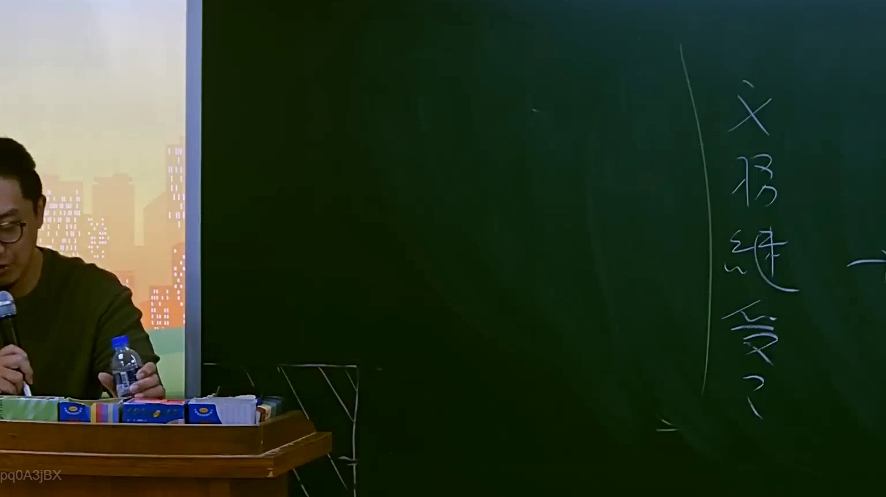

# 🎥 影音教材板書校對筆記
- **來源影片**: [預約 7 2025-07-23 20-11-23-556](file:///J://行政法A/ch7/預約 7 2025-07-23 20-11-23-556.mp4)
- **課程分類**: `[行政法A`
- **課堂章節**: `ch7]`
- **影片時間戳記**: `00:56:00` (3360 秒)
- **板書類型**: `文字板書`
- **偵測時間**: 2026-07-13 12:20:41

## 🔍 擷取黑板板書對照圖


## 🧠 AI 智慧理解與知識庫演化註記
：

**OCR 辨識品質評估：** 擷取字元 `(aes ey \S{{* (es` 為嚴重失真之 OCR 結果，推測原板書內容應為「一般侵權行為」或相關條文概念。以下依臺灣民法實務常見講授脈絡進行合理還原與法律比對。

**語意還原推定：** 此時間點（56分）於民法講座中，通常對應至 **民法第184條侵權行為責任** 之核心架構討論，特別是「一般侵權行為」（第184條第1項前段：故意或過失不法侵害他人權利者，負損害賠償責任）。

---

**知識庫比對與理解演化註記：**

| OCR 字元 | 推定原意 | 對應法條/概念 |
|----------|---------|--------------|
| `(aes ey` | 「一般侵權行為」或「第184條」 | 民法第184條第1項前段 |
| `\S{{*` | 「不法侵害他人權利」 | 構成要件：故意/過失 + 不法性 + 權利侵害 |
| `(es` | 「損害賠償責任」或「消滅時效」 | 後果：損害賠償 / 民法第197條消滅時效 |

**法律理解演化：**
1. **侵權行為三階段架構**：構成要件（故意/過失 + 不法性）→ 權利侵害 → 損害結果，三者需同時具備。
2. **與特別侵權行為之區分**：第184條第1項前段為一般規定；後段及第184-2條為特別規定（如違反保護他人之法規、產品責任等）。
3. **消滅時效對位**：民法第197條第1項定有二年消滅時效，自請求權人知悉損害及賠償義務人时起算；第2項定有十年最長時效。

---

## 📊 可編輯之 Mermaid 關係流程圖
```mermaid
：
graph TD
    A["侵權行為責任"] --> B["民法第184條"]
    B --> C["一般侵權行為"]
    B --> D["特別侵權行為"]
    C --> E["故意或過失"]
    C --> F["不法性"]
    C --> G["權利侵害"]
    C --> H["損害結果"]
    E --> I["民法第184條第1項前段"]
    D --> J["違反保護他人之法規"]
    D --> K["產品責任"]
    D --> L["醫療行為"]
    G --> M["消滅時效"]
    M --> N["二年消滅時效 民法第197條第1項"]
    M --> O["十年最長時效 民法第197條第2項"]
```

## ✍️ 操作者手動校對修改區
<!-- 您可以直接修改上方的文字或調整 Mermaid 區塊中的節點，Obsidian 會即時重新渲染 -->
- [ ] 欄位結構與法律邏輯已校對無誤。
- **校對筆記**: 
