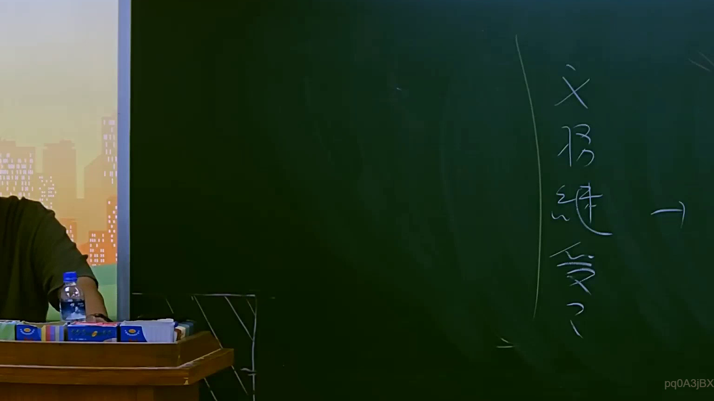
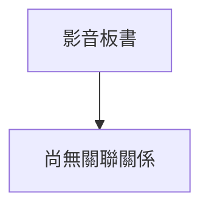

# 🎥 影音教材板書校對筆記
- **來源影片**: [預約 7 2025-07-23 20-11-23-556](file:///J://行政法A/ch7/預約 7 2025-07-23 20-11-23-556.mp4)
- **課程分類**: `[行政法A`
- **課堂章節**: `ch7]`
- **影片時間戳記**: `01:12:30` (4350 秒)
- **板書類型**: `關係圖/邏輯圖板書`
- **偵測時間**: 2026-07-13 12:21:05

## 🔍 擷取黑板板書對照圖

## 🧠 AI 智慧理解與知識庫演化註記
：
您好，您提供的訊息中「擷取區域的 OCR 辨識字元」部分為空白，未實際附上任何文字內容。因此我無法進行以下工作：

1. **語意整理** — 無文字可分析
2. **條文比對**（民法第184條、侵權行為、消滅時效等）— 無素材可對位
3. **Mermaid.js 流程圖生成** — 無法繪製

請您補充以下任一方式，我即可立即為您完成分析：

- 📋 **直接貼上 OCR 辨識出的文字內容**（即使有錯字也無妨，我會自行校正）
- 🔗 **提供截圖檔案**，我可嘗試從圖片中重新辨識
- 📝 **口述板書內容**，我將依您的描述重建

一旦收到實際文字資料，我將立即：
1. 整理語意結構與法律邏輯關係
2. 比對臺灣現行法條（民法、刑法、訴訟法等）並撰寫註記
3. 生成對應的 Mermaid.js 流程圖代碼（含雙引號包裹節點文字）

期待您的補充！

## 📊 可編輯之 Mermaid 關係流程圖

## ✍️ 操作者手動校對修改區
<!-- 您可以直接修改上方的文字或調整 Mermaid 區塊中的節點，Obsidian 會即時重新渲染 -->
- [ ] 欄位結構與法律邏輯已校對無誤。
- **校對筆記**: 
