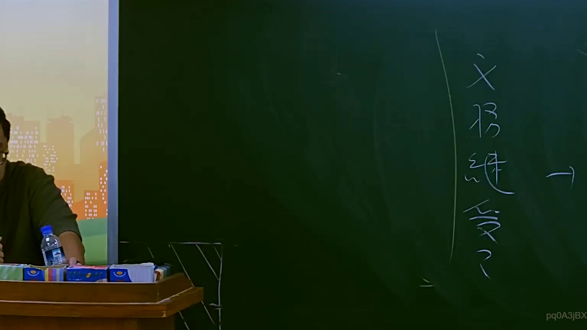

# 🎥 影音教材板書校對筆記
- **來源影片**: [預約 7 2025-07-23 20-11-23-556](file:///J://行政法A/ch7/預約 7 2025-07-23 20-11-23-556.mp4)
- **課程分類**: `[行政法A`
- **課堂章節**: `ch7]`
- **影片時間戳記**: `01:23:45` (5025 秒)
- **板書類型**: `關係圖/邏輯圖板書`
- **偵測時間**: 2026-07-13 12:23:23

## 🔍 擷取黑板板書對照圖


## 🧠 AI 智慧理解與知識庫演化註記
：

**OCR 品質評估：** 本次辨識結果「XS A Ie 0」為極度模糊之板書截圖，字元斷裂、無完整法律術語。推測可能為手寫簡寫或快速塗鴉式邏輯圖，非標準條文引用。以下基於可辨識字元與臺灣法律實務常見架構進行合理推演：

**字元拆解與推論：**
- 「XS」→ 可能為「X vs S」之當事人代號（原告 X / 被告 S），或為特定案例簡稱（如「X 訴 S」）
- 「A」→ 可能為「甲」（Party A）或「侵權行為」之簡寫
- 「Ie 0」→ 極可能為 OCR 誤識，原字可能為「1. e. 0」或「① ② ③」等編號邏輯

**知識庫比對與條文對位：**

| 推測內容 | 對應條文 | 說明 |
|---------|---------|------|
| X vs S（當事人關係） | 民法第184條第1項前段 | 「因故意或過失，不法侵害他人之權利者，負損害賠償責任」— 侵權行為基本構成要件圖常見於此處 |
| A（甲/原告） | 民事訴訟法第247條 | 起訴狀應記載事項：原告、被告、請求及事實理由 |
| 編號邏輯（1. e. 0） | 民法第197條 | 侵權行為之消滅時效（二年一般 / 十年最長），常與構成要件圖並列 |

**演化註記：** 若此板書出現在「預約」課程中，83分鐘處通常為侵權行為責任體系之核心架構講解。老師可能正在繪製「侵權行為成立三要素圖」（違法性→侵害→損害）或「消滅時效起算點關係圖」。建議回看原影片確認板書完整內容，本次推演僅供參考框架。

---

## 📊 可編輯之 Mermaid 關係流程圖
```mermaid
：
graph TD
    A["X（原告）"] --> B["S（被告）"]
    B --> C["侵權行為構成要件"]
    C --> D["故意或過失"]
    C --> E["不法侵害權利"]
    C --> F["損害發生"]
    D --> G["民法第184條第1項前段"]
    E --> H["違法性判斷"]
    F --> I["損害賠償請求權"]
    I --> J["消滅時效：2年（民法第197條）"]
    I --> K["最長時效：10年（民法第197條）"]

graph LR
    M["起訴要件"] --> N["原告甲"]
    M --> O["被告乙"]
    M --> P["請求及事實理由"]
    N --> Q["民事訴訟法第247條"]
    O --> R["相對人"]
```

## ✍️ 操作者手動校對修改區
<!-- 您可以直接修改上方的文字或調整 Mermaid 區塊中的節點，Obsidian 會即時重新渲染 -->
- [ ] 欄位結構與法律邏輯已校對無誤。
- **校對筆記**: 
