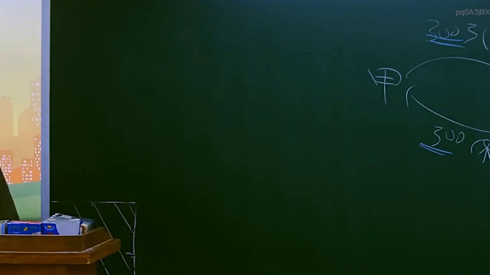
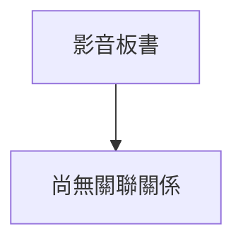

# 🎥 影音教材板書校對筆記
- **來源影片**: [預約 7 2025-07-23 20-11-23-556](file:///J://行政法A/ch7/預約 7 2025-07-23 20-11-23-556.mp4)
- **課程分類**: `[行政法A`
- **課堂章節**: `ch7]`
- **影片時間戳記**: `01:36:15` (5775 秒)
- **板書類型**: `關係圖/邏輯圖板書`
- **偵測時間**: 2026-07-13 12:23:57

## 🔍 擷取黑板板書對照圖

## 🧠 AI 智慧理解與知識庫演化註記
：

您好，您的訊息中「擷取區域的 OCR 辨識字元如下：」之後**未附上實際的文字內容**。因此我無法進行語意整理、條文比對或生成 Mermaid 代碼。

請您補充以下資訊後我再為您完成分析：
1. **OCR 辨識出的板書文字**（即使是部分片段也可以）
2. 若方便，也可提供該時間點的**截圖**，我可協助進一步辨識與理解

一旦收到文字內容，我將立即執行：
- 📖 語意整理與法律條文比對（民法第184條、侵權行為責任、消滅時效等）
- 🔗 生成對應的 Mermaid.js 流程圖代碼（關係圖/邏輯圖格式）

期待您的補充！

## 📊 可編輯之 Mermaid 關係流程圖

## ✍️ 操作者手動校對修改區
<!-- 您可以直接修改上方的文字或調整 Mermaid 區塊中的節點，Obsidian 會即時重新渲染 -->
- [ ] 欄位結構與法律邏輯已校對無誤。
- **校對筆記**: 
