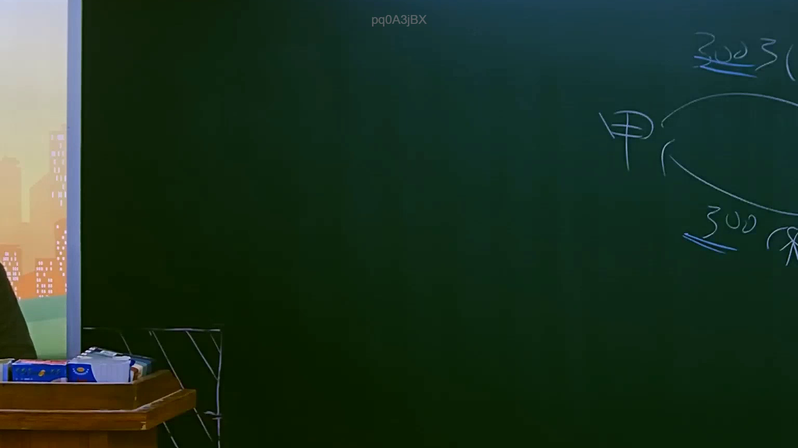

# 🎥 影音教材板書校對筆記
- **來源影片**: [預約 7 2025-07-23 20-11-23-556](file:///J://行政法A/ch7/預約 7 2025-07-23 20-11-23-556.mp4)
- **課程分類**: `[行政法A`
- **課堂章節**: `ch7]`
- **影片時間戳記**: `01:37:00` (5820 秒)
- **板書類型**: `關係圖/邏輯圖板書`
- **偵測時間**: 2026-07-13 12:24:16

## 🔍 擷取黑板板書對照圖


## 🧠 AI 智慧理解與知識庫演化註記
：

您好，您提供的訊息中「擷取區域的 OCR 辨識字元」部分為空白，未實際包含任何文字內容。因此我無法進行以下工作：

1. **語意整理** — 無文字可解析
2. **條文比對**（如民法第184條侵權行為、消滅時效等）— 無辨識結果可供對位
3. **Mermaid.js 流程圖生成** — 無法從空資料建構邏輯結構

---

## 📊 可編輯之 Mermaid 關係流程圖
```mermaid
：

（待您補充 OCR 辨識字元後，我將立即為您生成對應的 Mermaid 關係圖）

---

📌 **請回覆提供該時間點（97分0秒）的 OCR 辨識文字**，例如老師在黑板上書寫的內容、關係圖中的節點與箭頭描述等。收到後我會立刻完成：
- 語意整理與法律條文比對註記
- Mermaid.js 流程圖代碼生成
```

## ✍️ 操作者手動校對修改區
<!-- 您可以直接修改上方的文字或調整 Mermaid 區塊中的節點，Obsidian 會即時重新渲染 -->
- [ ] 欄位結構與法律邏輯已校對無誤。
- **校對筆記**: 
