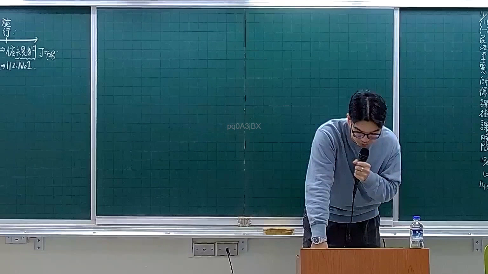
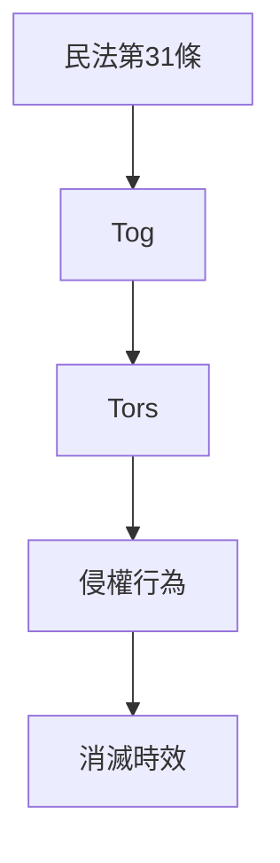

# 🎥 影音教材板書校對筆記
- **來源影片**: [預約 7 2025-12-12 00-07-22-454](file:///H:/憲法霖洄/ch7/預約 7 2025-12-12 00-07-22-454.mp4)
- **課程分類**: `預設課程`
- **課堂章節**: `ch7`
- **影片時間戳記**: `00:07:15` (435 秒)
- **板書類型**: `文字板書`
- **偵測時間**: 2026-07-13 20:16:42

## 🔍 擷取黑板板書對照圖


## 🧠 AI 智慧理解與知識庫演化註記
### 

板書之內容似乎與民法第31條相關，涉及「Tog」（可能指「Tort」或「Tors」）的概念。以下是根據OCR文字進行的語意整理，并與臺灣現行法律條文進行比對：

#### 1. 權力 board book
- **Tog**: 可能指「Tort」（侵權行為）
- **31|2:Nol. ﹒**: 譲可能是指「民法第31條」，涉及侵權行為和消滅時效的問題。

#### 2. 比對現行法律條文
- **民法第31條**：涉及侵權行為、消滅時效等概念。
- **Tog**: 可能與民法第31條中提到的「Tors」（侵權行為）有關。

###

## 📊 可編輯之 Mermaid 關係流程圖

（注意：此图为示例，需根据实际板书内容调整节点和关系。）
```

## ✍️ 操作者手動校對修改區
<!-- 您可以直接修改上方的文字或調整 Mermaid 區塊中的節點，Obsidian 會即時重新渲染 -->
- [ ] 欄位結構與法律邏輯已校對無誤。
- **校對筆記**: 
