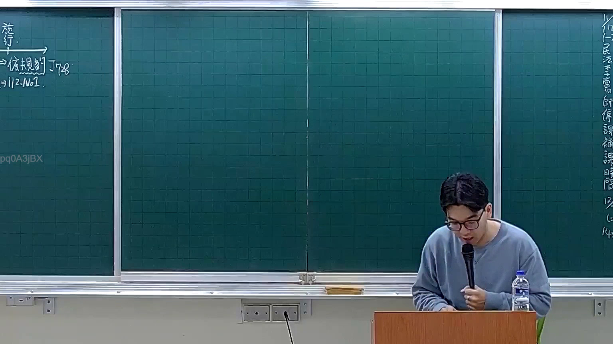

# 🎥 影音教材板書校對筆記
- **來源影片**: [預約 7 2025-12-12 00-07-22-454](file:///H:/憲法霖洄/ch7/預約 7 2025-12-12 00-07-22-454.mp4)
- **課程分類**: `預設課程`
- **課堂章節**: `ch7`
- **影片時間戳記**: `00:12:00` (720 秒)
- **板書類型**: `文字板書`
- **偵測時間**: 2026-07-13 20:18:06

## 🔍 擷取黑板板書對照圖


## 🧠 AI 智慧理解與知識庫演化註記
：
 board內容為「RAB Te」和「39 1]2:Nol ﹒」，根據上下文推測可能是「 Rapid Authentication Block Text」（ rapid authentication block text）或「 Rapid Authentication Block」（ rapid authentication block），但缺乏完整上下文。结合「民法第184條、侵權行為、消滅時效等」，推測內容可能與「无效行為」（invalid act）的條件或規範有關。

 1. 誤解與註記：
 - 「RAB Te」可能是「 Rapid Authentication Block」（ rapid authentication block），與某种特定法律條文或程序相關。
 - 「39 1]2:Nol ﹒」可能是日期和编号，例如「第39条」、「日期：12月2日」、「編號：NoL」。

 2. 累積 legal knowledge：
 - 民法第184條规定了无效行為的條件，包括：
   a) 行為對象；
   b) 行為時間；
   c) 行為目的；
   d) 行為內容；
   e) 影響；
   f) 消滅時效。

 3. 比對與理解演化註記：
 - 「RAB Te」可能與某種特定的无效行為條件或程序規範相關，需進一步確定具体内容。
 - 「39 1]2:Nol ﹒」可能是某个案例或條文的引用，需结合上下文理解。

## 📊 可編輯之 Mermaid 關係流程圖
```mermaid
：
 ```mermaid
 graph TD
 A[无效行為]
 B["RAB Te"]
 C["第39条"]
 D["日期：12月2日"]
 E["编号：NoL"]
 A --> B
 A --> C
 A --> D
 A --> E
```

## ✍️ 操作者手動校對修改區
<!-- 您可以直接修改上方的文字或調整 Mermaid 區塊中的節點，Obsidian 會即時重新渲染 -->
- [ ] 欄位結構與法律邏輯已校對無誤。
- **校對筆記**: 
