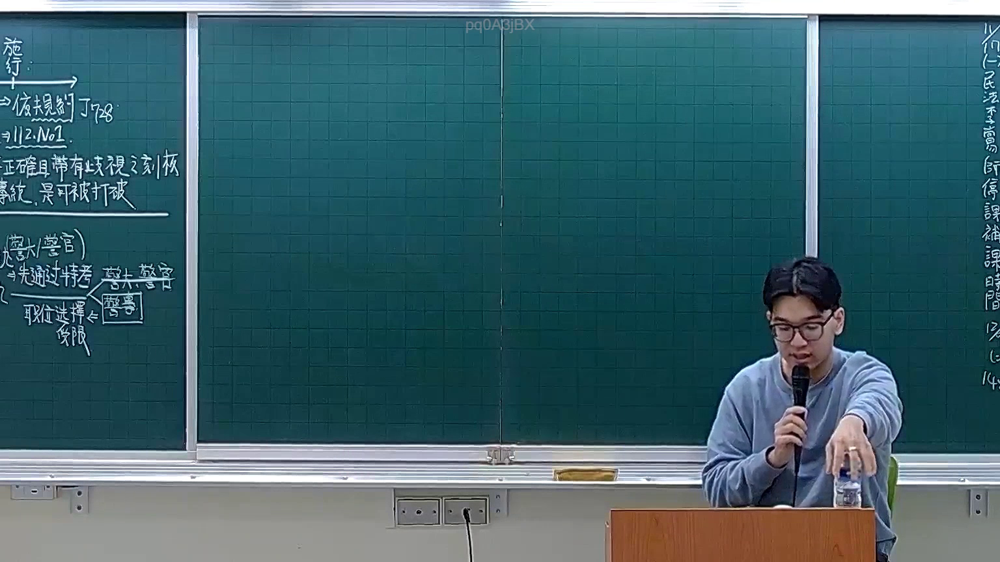
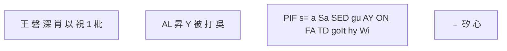

# 🎥 影音教材板書校對筆記
- **來源影片**: [預約 7 2025-12-12 00-07-22-454](file:///H:/憲法霖洄/ch7/預約 7 2025-12-12 00-07-22-454.mp4)
- **課程分類**: `預設課程`
- **課堂章節**: `ch7`
- **影片時間戳記**: `00:24:30` (1470 秒)
- **板書類型**: `文字板書`
- **偵測時間**: 2026-07-13 20:19:09

## 🔍 擷取黑板板書對照圖

## 🧠 AI 智慧理解與知識庫演化註記
### 

根據OCR文字內容，整理出以下之內容：

1. **板書內容摘要**：
   - "王 磐 深 肖 以 視 1 枇"：可能涉及书籍或出版内容，但缺乏完整上下文。
   - "AL 昇 Y 被 打 吳"：可能是人名或专有名词，如“吴世鸿”。
   - "PIF s= a Sa SED gu AY ON FA TD goIt hy Wi"：可能是英文缩写或术语，需结合上下文理解。
   - "﹣ 矽 心"：可能涉及某种计算方式或关键点。

2. **與臺灣現行法律條文的比對**：
   - 由于OCR文字存在拼寫錯誤或缺失完整上下文，無法直接與民法第184條等法律條文進行比對。
   - 可能涉及到other legal topics, such as copyright law, intellectual property rights, or related legal principles.

3. **法律理解演化註記**：
   - 由于OCR文字存在拼寫錯誤或缺失完整上下文，無法提供具體的法律條文比對結果。

###

## 📊 可編輯之 Mermaid 關係流程圖

## ✍️ 操作者手動校對修改區
<!-- 您可以直接修改上方的文字或調整 Mermaid 區塊中的節點，Obsidian 會即時重新渲染 -->
- [ ] 欄位結構與法律邏輯已校對無誤。
- **校對筆記**: 
