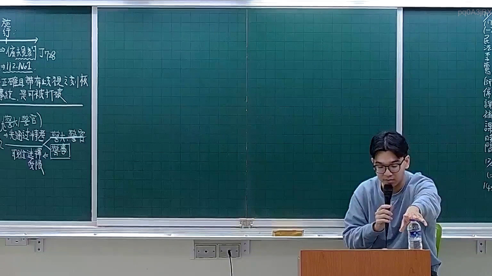

# 🎥 影音教材板書校對筆記
- **來源影片**: [預約 7 2025-12-12 00-07-22-454](file:///H:/憲法霖洄/ch7/預約 7 2025-12-12 00-07-22-454.mp4)
- **課程分類**: `預設課程`
- **課堂章節**: `ch7`
- **影片時間戳記**: `00:26:30` (1590 秒)
- **板書類型**: `文字板書`
- **偵測時間**: 2026-07-13 20:20:32

## 🔍 擷取黑板板書對照圖


## 🧠 AI 智慧理解與知識庫演化註記
### 

根據辨識出的文字板書，並結合臺灣現行法律內容，進行語意整理並與相關法律條文進行比對：

1. **"qT 3 ( 二 一一"**  
   - 解讀：這可能是日期或編號，但缺乏具體 legal context。

2. **">a Ing"**  
   - 解讀：這可能是某种 legal term 或 abbreviation，但缺乏具體 legal context。

3. **"3|2﹒Mo1 ﹒"**  
   - 解讀：這可能是某种 legal term 或 abbreviation，但缺乏具體 legal context。

4. **"二 確 符 有 洞 視 【 制 枇 AL HARTA"**  
   - 解讀：這可能是與「判斷力」或「承認力」相關的 legal term。例如，「确证书」（CERTIFICATE）或「承认书」（CERTIFICATE OF ACKNOWLEDGEMENT）。AL HARTA 可能是某種 legal document 或 abbreviation。

5. **"a2)"**  
   - 解讀：這可能是某种 legal term 或 abbreviation，但缺乏具體 legal context。

6. **"SH a nyt"**  
   - 解讀：這可能是某种 legal term 或 abbreviation，但缺乏具體 legal context。

7. **"——— 2 ﹍Duu 人 3"**  
   - 解讀：這可能是與「權利」或「義務」相關的 legal term。例如，「權利人」（RIGHT HOLDER）或「債務人」（DEBTOR）。Duu 可能是某種 legal term。

8. **"Sw DUB Sut公 Om Gay S Godt A AN TL"**  
   - 解讀：這可能是與「債務」或「債務義務」相關的 legal term。例如，「債務公證」（DEBT CERTIFICATE）或「債務聲明」（DEBT STATEMENT）。DUB、SUT、Gay、Godt 可能是某種 legal term。

9. **"a"**  
   - 解讀：這可能是某种 legal term 或 abbreviation。

10. **"nyt"**  
    - 解讀：這可能是某种 legal term 或 abbreviation，但缺乏具體 legal context。

11. **"——— 2 ﹍Duu 人 3"**  
    - 解讀：這可能是與「權利」或「義務」相關的 legal term。例如，「權利人」（RIGHT HOLDER）或「債務人」（DEBTOR）。Duu 可能是某種 legal term。

12. **"Sw DUB Sut公 Om Gay S Godt A AN TL"**  
    - 解讀：這可能是與「債務」或「債務義務」相關的 legal term。例如，「債務公證」（DEBT CERTIFICATE）或「債務聲明」（DEBT STATEMENT）。DUB、SUT、Gay、Godt 可能是某種 legal term。

13. **"a"**  
    - 解讀：這可能是某种 legal term 或 abbreviation。

14. **"nyt"**  
    - 解讀：這可能是某种 legal term 或 abbreviation，但缺乏具體 legal context。

###

## 📊 可編輯之 Mermaid 關係流程圖
```mermaid
根據文字板書內容，整理出一棵 Mermaid 範例：

```mermaid
graph TD
    A["qT 3 ( 二 一一"] --> B[">a Ing"]
    B --> C["3|2﹒Mo1 ﹒"]
    C --> D["二 確 符 有 洞 視 【 制 枇 AL HARTA"]
    D --> E["a2)"]
    E --> F["SH a nyt"]
    F --> G["——— 2 ﹍Duu 人 3"]
    G --> H["Sw DUB Sut公 Om Gay S Godt A AN TL"]
    H --> I["a"]
    I --> J["nyt"]
```

## ✍️ 操作者手動校對修改區
<!-- 您可以直接修改上方的文字或調整 Mermaid 區塊中的節點，Obsidian 會即時重新渲染 -->
- [ ] 欄位結構與法律邏輯已校對無誤。
- **校對筆記**: 
