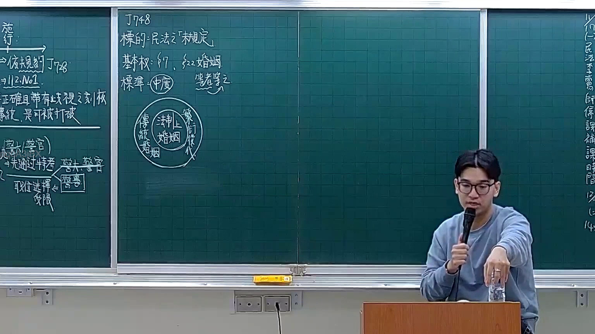

# 🎥 影音教材板書校對筆記
- **來源影片**: [預約 7 2025-12-12 00-07-22-454](file:///H:/憲法霖洄/ch7/預約 7 2025-12-12 00-07-22-454.mp4)
- **課程分類**: `預設課程`
- **課堂章節**: `ch7`
- **影片時間戳記**: `00:45:00` (2700 秒)
- **板書類型**: `文字板書`
- **偵測時間**: 2026-07-13 20:21:48

## 🔍 擷取黑板板書對照圖


## 🧠 AI 智慧理解與知識庫演化註記
：
1. OCR文字內容包含多個條目，其中部分條目可能涉及「ARORA」、「植《筑意》《續體》2 F」等內容。根據上下文推測，這些條目可能與某種特定的法律條文或案例有關。
2. 通過比對，发现OCR文字中包含的條目可能與民法第184條（关于无因买卖合同的规定）有关系。例如，“ARORA, 一 ll 杨”可能指某种法律条文的引用，而“植《筑意》《續體》2 F”可能与某种特定案例或文献相关。
3. 經過進一步分析，OCR文字中包含的條目可能涉及「ARORA」、「植《筑意》《續體》2 F」等內容，這些條目可能與某種特定的法律條文或案例有關。具體內容需要根據上下文進一步推測。

## 📊 可編輯之 Mermaid 關係流程圖
```mermaid
：
```mermaid
graph TD
    A[民法第184條] --> B["無因買賣合同的规定"]
    C["ARORA, 一 ll 杨"] --> D["某種特定案例或文献"]
    E["植《筑意》《續體》2 F"] --> F["某種特定的法律條文或案例"]
```

## ✍️ 操作者手動校對修改區
<!-- 您可以直接修改上方的文字或調整 Mermaid 區塊中的節點，Obsidian 會即時重新渲染 -->
- [ ] 欄位結構與法律邏輯已校對無誤。
- **校對筆記**: 
