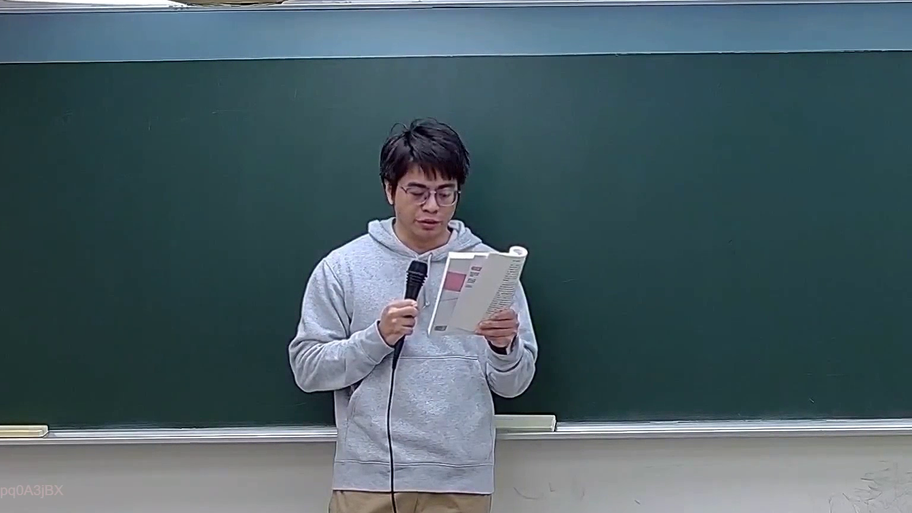
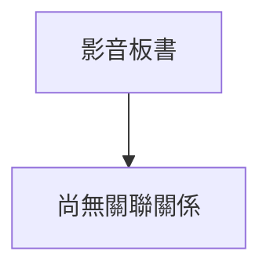

# 🎥 影音教材板書校對筆記
- **來源影片**: [預約 7 2026-03-16 21-17-16-029](file:///J://刑法B115/ch7/預約 7 2026-03-16 21-17-16-029.mp4)
- **課程分類**: `[刑法B115`
- **課堂章節**: `ch7]`
- **影片時間戳記**: `00:41:15` (2475 秒)
- **板書類型**: `關係圖/邏輯圖板書`
- **偵測時間**: 2026-07-13 09:22:09

## 🔍 擷取黑板板書對照圖

## 🧠 AI 智慧理解與知識庫演化註記
：

您好，我注意到您提供的訊息中，OCR 辨識字元區域為**空白**——在「擷取區域的 OCR 辨識字元如下：」之後並未附上實際的文字內容。因此我無法針對具體板書文字進行語意整理、條文比對與 Mermaid 圖表生成。

請您補充以下任一方式，我再為您完成分析：

1. **直接貼上 OCR 辨識出的文字**（即使有錯字或斷句問題也沒關係）
2. **描述老師在該時間點所寫的內容**（例如：「民法第184條第1項前段、故意不法侵害他人權利」等關鍵字）

一旦收到文字內容，我將立即執行：
- 語意整理與臺灣現行法律條文比對（含消滅時效、侵權行為責任等相關規定）
- 依分類類型生成對應的 Mermaid.js 流程圖或邏輯樹代碼

期待您的補充！

## 📊 可編輯之 Mermaid 關係流程圖

## ✍️ 操作者手動校對修改區
<!-- 您可以直接修改上方的文字或調整 Mermaid 區塊中的節點，Obsidian 會即時重新渲染 -->
- [ ] 欄位結構與法律邏輯已校對無誤。
- **校對筆記**: 
