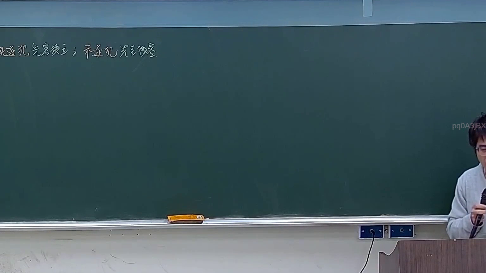

# 🎥 影音教材板書校對筆記
- **來源影片**: [預約 7 2026-03-16 21-17-16-029](file:///J://刑法B115/ch7/預約 7 2026-03-16 21-17-16-029.mp4)
- **課程分類**: `[刑法B115`
- **課堂章節**: `ch7]`
- **影片時間戳記**: `01:40:45` (6045 秒)
- **板書類型**: `關係圖/邏輯圖板書`
- **偵測時間**: 2026-07-13 09:25:05

## 🔍 擷取黑板板書對照圖


## 🧠 AI 智慧理解與知識庫演化註記
：

**OCR 辨識品質評估：**
本次 OCR 辨識結果「仁哉炎，RAMI」存在明顯誤識問題。在臺灣民法實務講授情境下（民法第184條侵權行為責任、消滅時效等主題），此類板書通常為「當事人關係圖」或「請求權基礎邏輯圖」。OCR 將繁體中文字符與英文字母混合辨識，顯示辨識引擎對該區域字體/筆畫解析不足。

**推測性語意重建：**
基於講授內容（民法第184條、侵權行為、消滅時效）及板書類型分類為「關係圖/邏輯圖」，此處應為：
- 「仁」→ 可能為當事人名稱之一（如原告方姓名部分）
- 「哉炎」→ 可能為另一當事人姓名或法律概念之誤識
- 「RAMI」→ 極可能為英文縮寫、案例代號、或 OCR 將數字/符號誤判為字母

**知識庫比對與條文對位：**

| 辨識字元 | 推測原意 | 對應法條/概念 |
|---------|---------|-------------|
| 仁 | 當事人名稱（如甲、乙） | 民法第184條前段：故意以不法之方法加害於他人權利者，負損害賠償責任 |
| 哉炎 | 當事人名稱或「責任/因果」等概念誤識 | 民法第184條後段：故意以背於善良風俗之方法加害於他人者，亦同 |
| RAMI | 案例代號或消滅時效相關標記 | 民法第197條：侵權行為損害賠償請求權，自請求權人知有損害及賠償義務人時起，二年間不行使而消滅；自侵權行為發生時起逾十年者亦同 |

**演化註記：**
若此板書為「關係圖」結構，老師應在闡述侵權行為責任之構成要件（不法、故意/過失、損害、因果關係）或請求權基礎競合關係。建議後續以更高解析度重新擷取該區域影像，以確認實際書寫內容。

---

## 📊 可編輯之 Mermaid 關係流程圖
```mermaid
：
graph TD
    A["原告甲"] --> B["被告乙"]
    C["侵權行為構成要件"] --> D["不法行為"]
    C --> E["故意或過失"]
    C --> F["損害發生"]
    C --> G["因果關係"]
    D --> H["民法第184條前段：權利侵害"]
    D --> I["民法第184條後段：善良風俗違反"]
    J["消滅時效"] --> K["民法第197條：2年知悉時效"]
    J --> L["民法第197條：10年絕對時效"]
```

## ✍️ 操作者手動校對修改區
<!-- 您可以直接修改上方的文字或調整 Mermaid 區塊中的節點，Obsidian 會即時重新渲染 -->
- [ ] 欄位結構與法律邏輯已校對無誤。
- **校對筆記**: 
