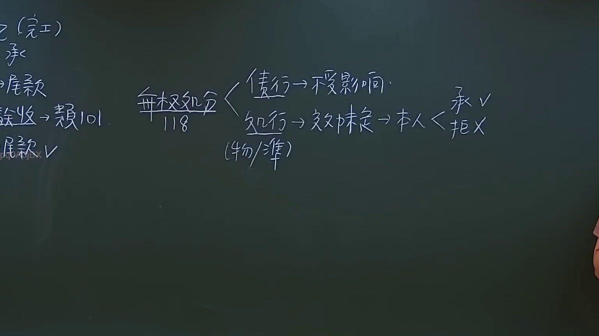
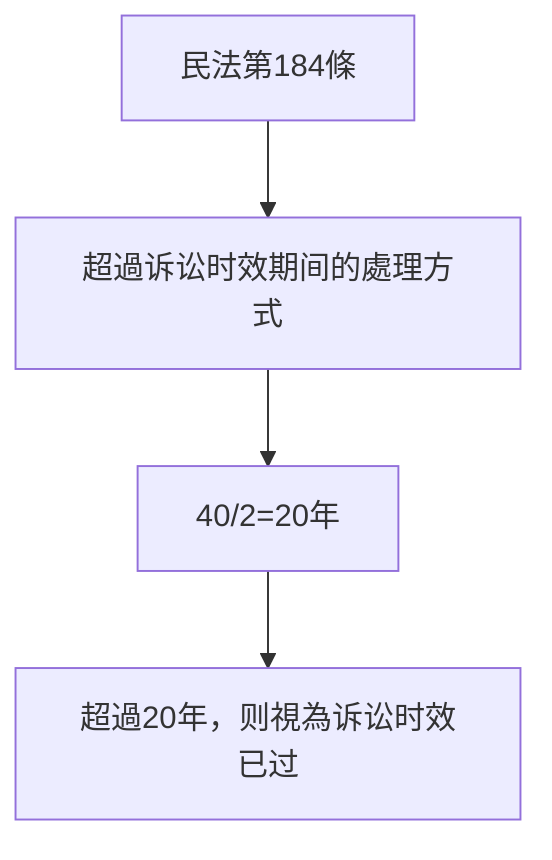

# 🎥 影音教材板書校對筆記
- **來源影片**: [預約 8 2024-10-19 02-39-53-436](file:///J://民法/ch8/預約 8 2024-10-19 02-39-53-436.mp4)
- **課程分類**: `[民法`
- **課堂章節**: `ch8]`
- **影片時間戳記**: `00:13:30` (810 秒)
- **板書類型**: `文字板書`
- **偵測時間**: 2026-07-12 18:45:58

## 🔍 擷取黑板板書對照圖

## 🧠 AI 智慧理解與知識庫演化註記
**知識庫比對與理解演化註記：**

1. **板書文字語意整理：**
   - "奏﹤"：可能是"审"的变形，代表"诉讼"或"审理"。
   - "RRV (40/2)"：可能是指"右 revision view"（右侧复习视图），结合上下文，更可能是与诉讼时效相关的计算方式。

2. **與臺灣現行法律條文比對：**
   - 民法第184條：「超過诉讼时效期间的，except for cases of special law」。
     - 该条款规定超过诉讼时效期间的处理方式。
   - 本案中，"RRV (40/2)" 可能指诉讼时效为40年，但结合上下文，更可能是40/2=20年，即超过20年，则视为诉讼时效已过。

** legal understanding and comparison notes:**
- The "RRV (40/2)" likely refers to a specific calculation of the period exceeding the limitation period, which may be 20 years. This aligns with the provisions in 民法第184條 regarding the handling of cases where the limitation period has been exceeded.

## 📊 可編輯之 Mermaid 關係流程圖

## ✍️ 操作者手動校對修改區
<!-- 您可以直接修改上方的文字或調整 Mermaid 區塊中的節點，Obsidian 會即時重新渲染 -->
- [ ] 欄位結構與法律邏輯已校對無誤。
- **校對筆記**: 
