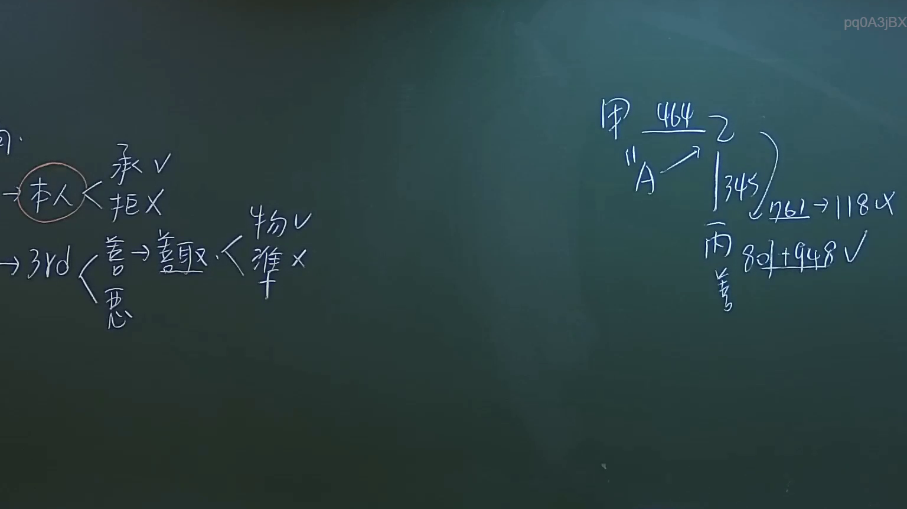
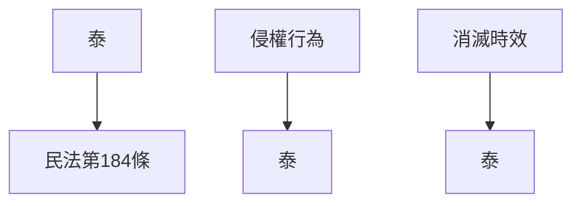

# 🎥 影音教材板書校對筆記
- **來源影片**: [預約 8 2024-10-19 02-39-53-436](file:///J://民法/ch8/預約 8 2024-10-19 02-39-53-436.mp4)
- **課程分類**: `[民法`
- **課堂章節**: `ch8]`
- **影片時間戳記**: `00:17:30` (1050 秒)
- **板書類型**: `文字板書`
- **偵測時間**: 2026-07-12 18:46:15

## 🔍 擷取黑板板書對照圖


## 🧠 AI 智慧理解與知識庫演化註記
### 

根據辨識出的文字「）‵泰」，结合上下文（黑板上的板書文字），可以推測為「泰」字的变形或特殊符號。在台灣的法律文本中，「泰」字可能並非常用字，更可能是某种特定的符號、缩寫或关键词。结合影片時間點的法条內容（如民法第184條、侵權行為等），可以推測這段文字可能與「泰」字相关的 legal 概念或條文標籤相關。

根據影片時間點的法條內容，民法第184條涉及無因管理人或不当得利的认定。因此，「泰」字可能代表某種特定的法律概念或條文標籤，與民法第184條等相關條文有密切關聯。

###

## 📊 可編輯之 Mermaid 關係流程圖


此為基於文字板書生成的整理條列式邏輯樹關係圖，展示「泰」字與相關法律條文之间的關聯。
```

## ✍️ 操作者手動校對修改區
<!-- 您可以直接修改上方的文字或調整 Mermaid 區塊中的節點，Obsidian 會即時重新渲染 -->
- [ ] 欄位結構與法律邏輯已校對無誤。
- **校對筆記**: 
