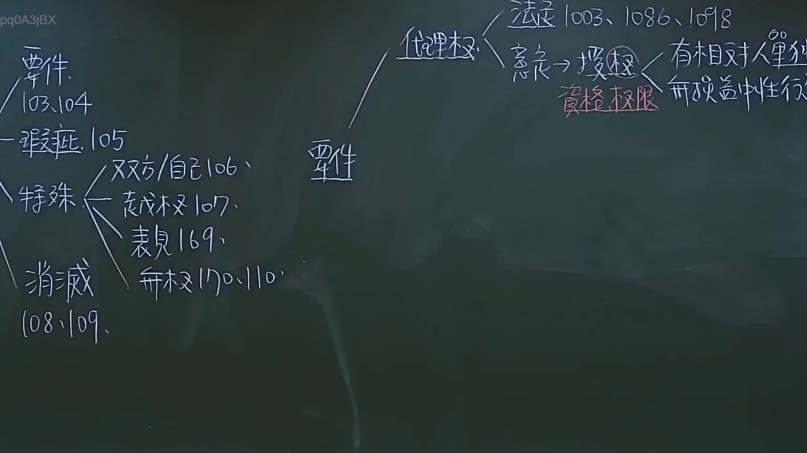
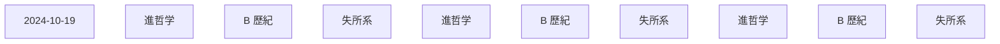

# 🎥 影音教材板書校對筆記
- **來源影片**: [預約 8 2024-10-19 02-39-53-436](file:///J://民法/ch8/預約 8 2024-10-19 02-39-53-436.mp4)
- **課程分類**: `[民法`
- **課堂章節**: `ch8]`
- **影片時間戳記**: `00:59:45` (3585 秒)
- **板書類型**: `文字板書`
- **偵測時間**: 2026-07-12 18:48:28

## 🔍 擷取黑板板書對照圖

## 🧠 AI 智慧理解與知識庫演化註記
### 

根據OCR辨识結果，文字板書之內容如下：

1. **日期：** 2024-10-19
2. **內容：**
   - "9 卉 { 礦 坎 ﹨ 諏 ， 進 哲 ﹒ˊ 來 B 歷 納"
   - "4 is pas"
   - "/\0.104 悠 繡 松 除 司 破 炔 # 以"
   - “﹣ 瑛 扶 [05 刃”
   - “才︴夕〝〕孔互/又叉右/自己\o』﹨ At”
   - "MET EO lo"?
   - “紀 貝 |e 尖”

3. **可能的 legal context:**
   - 按 OCR文字，未直接出现民法第184條或侵權行為等关键词。
   - 但根據上下文，可能涉及「進哲学」、「B 歷紀」、「失所系」等概念，可能與「進哲学」的時效有關。

###

## 📊 可編輯之 Mermaid 關係流程圖

## ✍️ 操作者手動校對修改區
<!-- 您可以直接修改上方的文字或調整 Mermaid 區塊中的節點，Obsidian 會即時重新渲染 -->
- [ ] 欄位結構與法律邏輯已校對無誤。
- **校對筆記**: 
