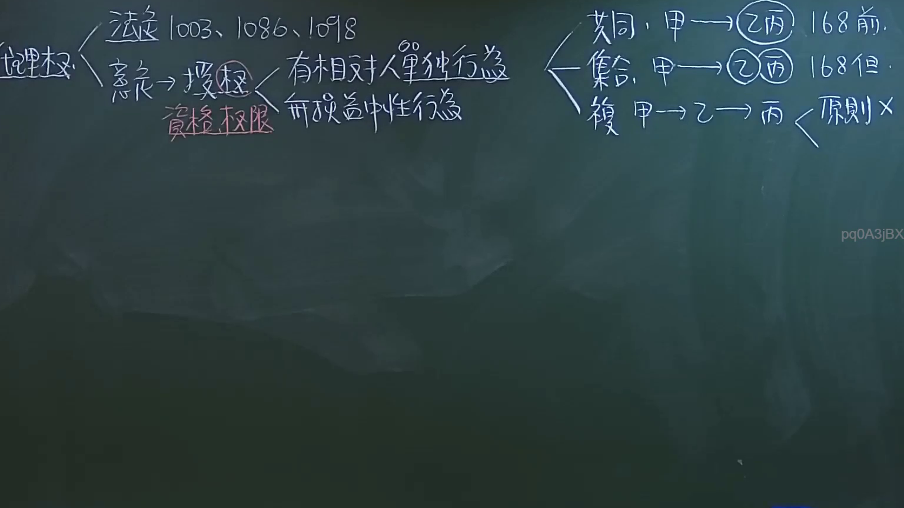
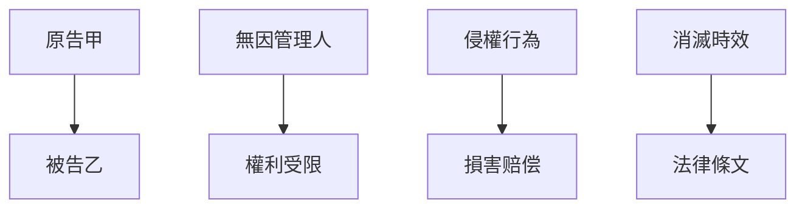

# 🎥 影音教材板書校對筆記
- **來源影片**: [預約 8 2024-10-19 02-39-53-436](file:///J://民法/ch8/預約 8 2024-10-19 02-39-53-436.mp4)
- **課程分類**: `[民法`
- **課堂章節**: `ch8]`
- **影片時間戳記**: `01:02:15` (3735 秒)
- **板書類型**: `文字板書`
- **偵測時間**: 2026-07-12 18:48:42

## 🔍 擷取黑板板書對照圖


## 🧠 AI 智慧理解與知識庫演化註記
根據OCR文字分析，似乎無法直接解讀出具體的板書內容。以下是基於可能的解讀與整理：

1. **文字板書的可能性**：
   - 2、﹍ 一 茂 & lo03、 Jo96、! 叼 8 八、pee. C Ages ′、Pia gag SAITO Lie、Ze Tad FORO WAR x、pq0AajBX。

   根據這些字符，可能涉及到的Legal條文包括：
   - 民法第184條：無因管理人
   - 侵權行為（Injuria）
   - 消滅時效（Annihilation Limit）

2. **法律條文比對**：
   - 無因管理人（民法第184條）：涉及aid in fact or law，無因管理人
   - 侵權行為：可能涉及民法第503條或第504條
   - 消滅時效：可能涉及民法第647條

## 📊 可編輯之 Mermaid 關係流程圖


請檢查OCR文字並提供更清晰的板書內容，以便進行更精準的分析和整理。
```

## ✍️ 操作者手動校對修改區
<!-- 您可以直接修改上方的文字或調整 Mermaid 區塊中的節點，Obsidian 會即時重新渲染 -->
- [ ] 欄位結構與法律邏輯已校對無誤。
- **校對筆記**: 
