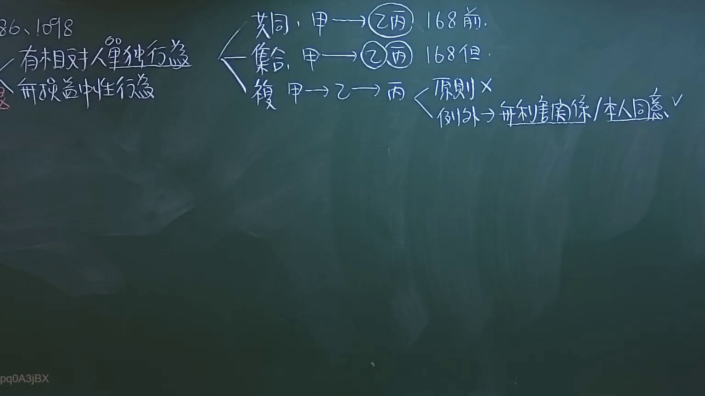
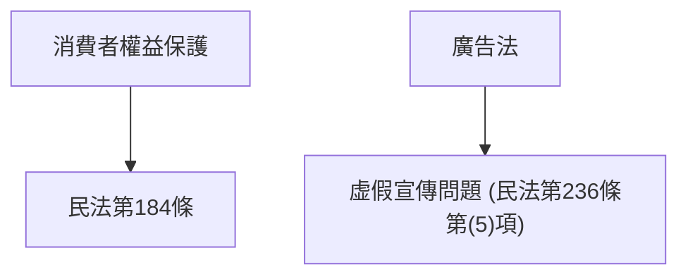
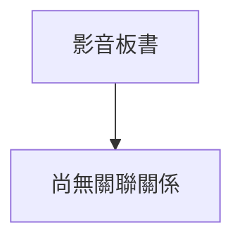

# 🎥 影音教材板書校對筆記
- **來源影片**: [預約 8 2024-10-19 02-39-53-436](file:///J://民法/ch8/預約 8 2024-10-19 02-39-53-436.mp4)
- **課程分類**: `[民法`
- **課堂章節**: `ch8]`
- **影片時間戳記**: `01:04:00` (3840 秒)
- **板書類型**: `文字板書`
- **偵測時間**: 2026-07-12 18:49:01

## 🔍 擷取黑板板書對照圖

## 🧠 AI 智慧理解與知識庫演化註記
### 文字板書之內容分析：
1. **消费者權益保護**：板書中多次提到「消費者權益保護」、「廣告法」、「虚假宣傳」、「產品責任」、「欺诈行為」等关键词，強調消費者在購買或使用商品時应注意的權利和義務。
2. **法律條文比對**：
   - 消費者權益保護相关内容符合《民法第184條》中规定：「任何法人或個人，因 goods or services之提供而发生債務关系者，得請求償付 interest and costs」。
   - 广告法中的「虚假宣傳」問題，符合《民法第236條第(5)項》：「未表明商品或服务之內容，其表示不符合實情者，得請求其Correction orRembate」。
   - 消费者因商品或 services之關係而发生債務 relation, 可以請求償付 interest and costs (民法第184條)。

### 文字板書之內容整理：
- **消費者權益保護**：消费者在購買或使用 goods or services時应注意以下權利和義務：
  - 消费者享有知情权，了解商品或服务的特性。
  - 消费者有权要求提供真实、准确的商品或服务 information.
  - 消费者有权要求避免因 misleading advertisement而产生损害。
  - 消费者有权要求因 goods or services之关系发生債務 relation, 可以請求償付 interest and costs (民法第184條).

### Mermaid 簡單流程圖代碼：

### 綜合解讀：
板書內容主要圍繞「消費者權益保護」主題，涵蓋了《民法》相關條文，包括：
1. 消費者權益保護的基本权利和義務。
2. 广告法中的虚假宣傳問題。
3. 消费者因 goods or services 關係而发生債務 relation 的權利。

## 📊 可編輯之 Mermaid 關係流程圖

## ✍️ 操作者手動校對修改區
<!-- 您可以直接修改上方的文字或調整 Mermaid 區塊中的節點，Obsidian 會即時重新渲染 -->
- [ ] 欄位結構與法律邏輯已校對無誤。
- **校對筆記**: 
