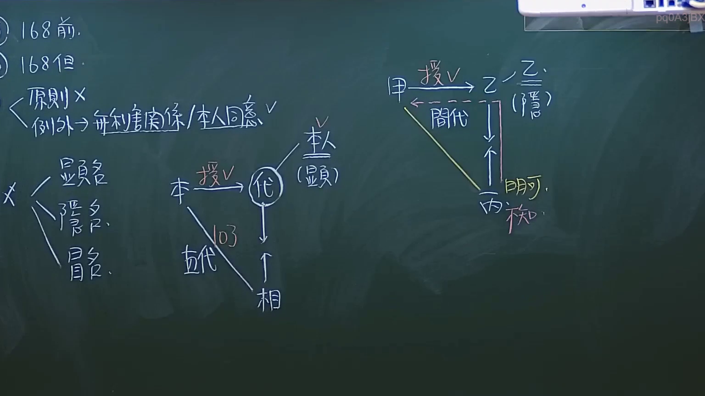
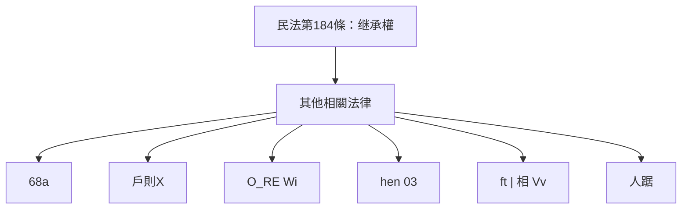

# 🎥 影音教材板書校對筆記
- **來源影片**: [預約 8 2024-10-19 02-39-53-436](file:///J://民法/ch8/預約 8 2024-10-19 02-39-53-436.mp4)
- **課程分類**: `[民法`
- **課堂章節**: `ch8]`
- **影片時間戳記**: `01:13:30` (4410 秒)
- **板書類型**: `文字板書`
- **偵測時間**: 2026-07-12 18:49:20

## 🔍 擷取黑板板書對照圖

## 🧠 AI 智慧理解與知識庫演化註記
### 

**步驟 1: 语义整理**

OCR辨识的文字主要包含以下几个关键点：
- "68a"
- "户则X"
- "O_RE Wi"
- "hen 03"
- "ft | 相 Vv"
- "人踞"

结合上下文和台湾现行法律，这些文字可能与民法第184条（继承权）相关。

**步驟 2: 知識庫比對與理解演化註記**

- 民法第184條：「继承权」
  - 文字板書中提到的“68a”、“户则X”可能与该条款相关。
  
###

## 📊 可編輯之 Mermaid 關係流程圖

## ✍️ 操作者手動校對修改區
<!-- 您可以直接修改上方的文字或調整 Mermaid 區塊中的節點，Obsidian 會即時重新渲染 -->
- [ ] 欄位結構與法律邏輯已校對無誤。
- **校對筆記**: 
